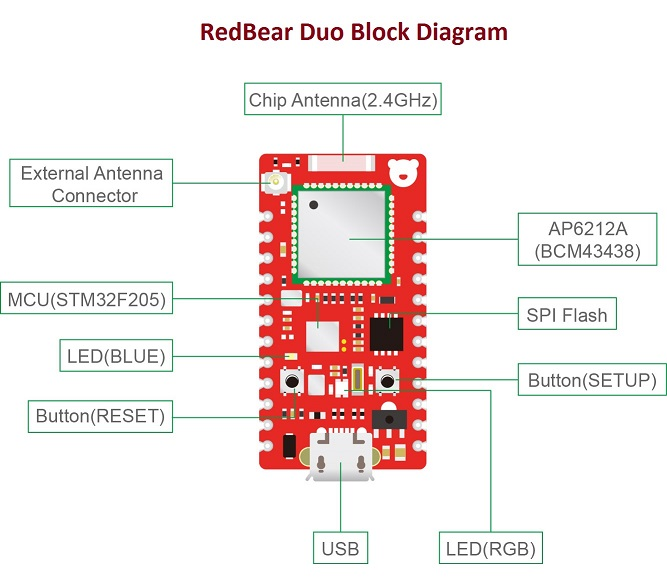
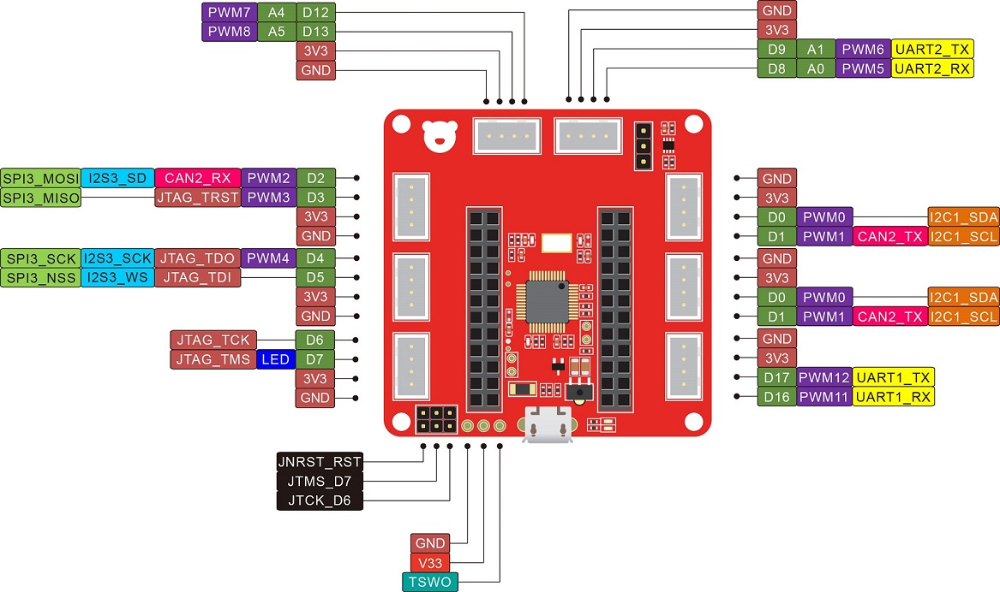

## RedBear Duo

The [RedBear Duo](http://www.redbear.cc/duo) is a thumb-size development board designed to simplify the process of building Internet of Things (IoT) products. The Duo is software compatible with Broadcom WICED SDK and provides everything you need—Wi-Fi, BLE and a powerful Cloud backend, all in a compact form factor that makes it ideal for your first prototype, a finished product, and everything in between. 

The Duo contains both Wi-Fi and BLE capabilities. This means your project can communicate locally with Bluetooth enabled devices and can also connect to your local Wi-Fi network to interact with anything else on the web. The Duo is built around the Broadcom BCM43438, a Wi-Fi 802.11b/g/n plus Bluetooth 4.1 (Dual Mode) combined chipset. They share the same 2.4GHz antenna and can run at the same time. This gives you the flexibility to utilize the most suitable wireless technology(s) for your project.

With the RedBear RBLink you can easily attach modules from the Seeed’s Grove System to your project. No need to pull out your soldering iron--just attach your sensors and actuators with jumper wires to the RBLink and you’re ready to go. Looking to attach your own sensor or peripheral? The Duo is breadboard and solder friendly, so you’re never limited in what you can connect to the web.

The Duo supports Particle's Cloud and WebIDE and it works as same as the Photon board for the WiFi part. Moreover, the Duo has BLE, more flash memory space and you can make use of them on your innovative projects.

## Features

* WiFi + BLE
* Development – [Arduino Sketches](https://github.com/redbear/STM32-Arduino), [Espruino - JavaScript](https://github.com/redbear/Espruino), C/C++
* Cloud – [Particle](https://www.particle.io/) Cloud
* Support [WICED WiFi](https://community.broadcom.com/community/wiced-wifi) SDK
* Open-source – [BTstack](https://github.com/bluekitchen/btstack), [FreeRTOS](http://www.freertos.org/), [LwIP](http://savannah.nongnu.org/projects/lwip/) and others

## Applications

* Industrial Automation
* Building Automation
* Smart Home Appliances
* Smart Toys
* IoT Enabled Sensors
* WiFi/BLE Gateway
* Beacon Management

## Certifications

The Duo and the RBLink are certified by the FCC & CE certifications, the FCC ID is `2ABXJ-DUO`.

The soft copy of the certifications can be found [here](docs/certs).

## Hardware

#### Duo

* STMicroelectronics STM32F205 ARM Cortex-M3 @ 120 MHz, 128 KB SRAM, 1 MB Flash
* AMPAK AP6212A (Broadcom BCM43438 chip), Wi-Fi 802.11n (2.4 GHz only) + Bluetooth 4.1 (Dual Mode) combo module (With an upgrade path to Bluetooth 4.2)
* On-board 16 Mbit (2 MB) SPI Flash
* Signal chip antenna (option to connect ext. antenna)
* 18 I/O pins, 1 user LED
* RGB status LED
* RESET and SETUP buttons
* USB, 2 UART, JTAG, 2 SPI, I2C
* Single-sided PCBA for easy mounting on other PCB
* Operating voltage is 3.3v
* 20.5 mm x 39 mm
* [Schematic](schematic/)

#### RBLink

* Running ST-LINK/V2
* USB-based JTAG debugger/programmer
* Two JTAG activity LEDs
* Apple MFi authentication coprocessor support (**MFi license is required)
* USB MSD interface – enabling programming the Duo by drag and drop of firmware file
* USB CDC Virtual Serial Port
* STM32 ST-LINK Utility software compatible
* 8x Seeed Grove System compatible connectors
* 53.5mm x 53.5mm
* [Schematic](schematic/)

#### Pinout

##### Duo:

##### RBLink:

## Development Platforms

The Duo is so flexible since it supports different development platforms. Now, you should define yourself here.

#### WebIDE and Arduino

If you are interested in using [Particle's WebIDE](build.particle.io) for online development or [Arduino](https://github.com/redbear/STM32-Arduino) for offline development, you can continue reading this document.

#### WICED SDK

For professional developers (good at C language) who want to develop projects (e.g. HomeKit) using Broadcom's WICED SDK, the following sections of this document are not useful for you and you can refer to our [WICED-SDK](https://github.com/redbear/WICED-SDK) repository directly.

#### JavaScript

For Web developers who also want to do IoT projects with the Duo, you can use our [JavaScript interpreter](javascript) (based on [Espruino](https://github.com/redbear/Espruino) open source project) for development.

## Internals

#### Memory Map

The Duo's memory allocation is different from the Photon. The following diagram shows that the Duo has an external flash while the Photon does not. The external flash stores the WiFi firmware to be loaded to the BCM43438 chip during boot-up as well as other recovery firmware. Thus, this design allows the entire the internal flash memory space of 256KB to be available for the user sketch, compared to the Photon with only 128KB.

Bootloader and system firmware are stored in the internal flash memory, the source code for these is on RedBear github repository - [[2] Firmware](https://github.com/redbear/firmware).

#### Bootloader

The Duo MCU boots from the internal memory address 0x08000000, where the bootloader is located. The bootloader keeps track of the firmware and provides functions to flash firmware via the USB port (e.g. DFU Mode). If it has nothing to do during the boot time, it will pass the control to system part 1.

#### DCT 1 & 2

Device Configuration Table (DCT), is a non-volatile flash storage space for storing board configuration such as WiFi credentials (SSID, PIN, etc.).

#### EEPROM

EEPROM 1 & 2 is to use flash memory to simulate EEPROM for user storage.

#### System Part 1 & 2

The Duo firmware is modular in structure, as dynamic libraries (dynalib) and are stored in the system partitions of the internal flash memory.

System Part 1 is for storing communication/security dynalib that used for connecting the Duo to the Particle cloud. Originally, for the Photon, the WiFi firmware is stored here but for the Duo, it is not.

Basically, there is no code to be run in partition 1 and it just passes the control to partition 2.

System Part 2 performs a lot of tasks, firstly, it checks the WiFi firmware stored in the external flash and loads it into the AP6216A module (BCM43438 chip). Then it will start BLE and WiFi for doing WiFi provisioning if it has not connected before, otherwise, it will try to associate to a known Wireless Access Point (e.g. home router). Finally, it will connect to the Particle cloud as well.

The partition 2 firmware has a copy of bootloader, if it found the bootloader version is lower than the copy, then it will update the bootloader automatically.

When everything is ready, it will pass the control to the user partition (your own firmware), `setup()` and `loop()`.

## RGB LED, SETUP Button & USB

#### RGB LED

The bootloader makes use of the onboard RGB LED as a status indicator. When you are pressing and holding the SETUP button and then pressing the reset button (still holding the SETUP button), the Duo will enter to the bootloader for an user action, releasing the SETUP button when the LED is in one of the following state:

* [Yellow Flashing](docs/images/Duo-Yellow.gif)	: DFU Mode
* [Green Flashing](docs/images/Duo-Green.gif)	: Factory Reset Mode (not clear the WiFi credentials in DCT)
* [White Flashing](docs/images/Duo-White.gif)	: Factory Reset Mode (copy factory reset image from the external flash to the user partition and clear the WiFi credentials in DCT).

If you need to use the [DFU](docs/dfu.md) to deploy your user-part firmware, read [firmware](firmware/README.md) page for details.

#### SETUP Button

When the Duo is running, at any time, you can press and hold the SETUP button for 3 seconds to enter the 'Listening Mode', the RGB in [flashing blue](docs/images/Duo-Blue.gif) for doing WiFi provisioning. For details, read [getting started guide](docs/getting_started.md).

#### USB

The onboard USB provides two functions, DFU and CDC. DFU is for Device Firmware Upgrade, CDC is for Serial communication to PC so that you can print out debug messages, e.g. `Serial.println("Test")`.

## Documentation

* [Getting Started Guide](docs/getting_started.md)
* [Windows Driver Installation Guide](docs/driver.md)
* [DFU Installation Guide](docs/dfu.md)
* [Firmware Management Guide](firmware/README.md)
* [Provisioning Guide](docs/provisioning_guide.md)
* [Trouble Shooting](docs/troubleshooting.md)
* [Arduino](https://github.com/redbear/STM32-Arduino)
* [WICED SDK](https://github.com/redbear/WICED-SDK)
* [BTstack - BLE API and other documents](https://github.com/bluekitchen/btstack/)

## ToDo

* Add more BLE examples to the Particle WebIDE and Arduino IDE.

	The BLE examples are not completed yet, for WebIDE, we have not yet added any examples for BLE, if you want to try BLE using WebIDE, please browse [this](https://github.com/redbear/STM32-Arduino/tree/master/arduino/libraries/RedBear_Duo/examples/03.BLE), copy & paste the code to the WebIDE.

* Reduce power consumption for BLE

	We will work with Broadcom to reduce the power consumption for the Duo BLE.

## Resources

* [[1] Product Page](http://redbear.cc/duo/) - RedBear Duo
* [[2] Duo Firmware](https://github.com/redbear/firmware) - RedBear Duo firmware source code
* [[3] RedBear Duo Forum](http://discuss.redbear.cc)
* [[4] Particle Forum](https://community.particle.io)
* [[5] BTstack](https://github.com/bluekitchen/btstack) - BTstack GitHub Repository
* [[6] BlueKitchen-GmbH](https://bluekitchen-gmbh.com/) - BTstack Official Website
* [[7] Program with Arduino IDE](https://github.com/redbear/STM32-Arduino)
* [[8] Program with Broadcom WICED SDK](https://github.com/redbear/WICED-SDK)
* [[9] Espruino](https://github.com/redbear/Espruino) - JavaScript Interpreter source code

## License

Copyright (c) 2016 Red Bear

Permission is hereby granted, free of charge, to any person obtaining a copy of this software and associated documentation files (the "Software"), to deal in the Software without restriction, including without limitation the rights to use, copy, modify, merge, publish, distribute, sublicense, and/or sell copies of the Software, and to permit persons to whom the Software is furnished to do so, subject to the following conditions:

The above copyright notice and this permission notice shall be included in all copies or substantial portions of the Software.

THE SOFTWARE IS PROVIDED "AS IS", WITHOUT WARRANTY OF ANY KIND, EXPRESS OR IMPLIED, INCLUDING BUT NOT LIMITED TO THE WARRANTIES OF MERCHANTABILITY, FITNESS FOR A PARTICULAR PURPOSE AND NONINFRINGEMENT. IN NO EVENT SHALL THE AUTHORS OR COPYRIGHT HOLDERS BE LIABLE FOR ANY CLAIM, DAMAGES OR OTHER LIABILITY, WHETHER IN AN ACTION OF CONTRACT, TORT OR OTHERWISE, ARISING FROM, OUT OF OR IN CONNECTION WITH THE SOFTWARE OR THE USE OR OTHER DEALINGS IN THE SOFTWARE.
