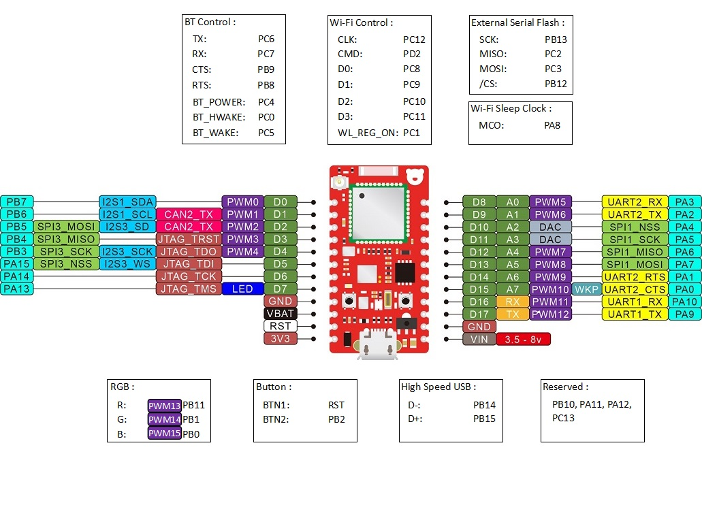

## RedBear Duo

The Red Bear Duo is a thumb-size development board designed to simplify the process of building Internet of Things (IoT) products. The Duo is software compatible with Broadcom WICED SDK and provides everything you need—Wi-Fi, BLE and a powerful Cloud backend, all in a compact form factor that makes it ideal for your first prototype, a finished product, and everything in between. 

The Duo contains both Wi-Fi and BLE capabilities. This means your project can communicate locally with Bluetooth enabled devices and can also connect to your local Wi-Fi network to interact with anything else on the web. The Duo is built around the Broadcom BCM43438, a Wi-Fi 802.11b/g/n plus Bluetooth 4.1 (Dual Mode) combined chipset. They share the same 2.4GHz antenna and can run at the same time. This gives you the flexibility to utilize the most suitable wireless technology(s) for your project.

## Features

Duo:
•	STMicroelectronics STM32F205 ARM Cortex-M3 @ 120 MHz, 128 KB SRAM, 1 MB Flash
•	Broadcom BCM43438 Wi-Fi 802.11n (2.4GHz only) + Bluetooth 4.1 (Dual Mode) combo chip
(With an upgrade path to Bluetooth 4.2)
•	On-board 16 Mbit (2 MB) SPI Flash
•	Signal chip antenna (option to connect ext. antenna)
•	18 I/O pins, 1 user LED
•	RGB status LED
•	USB, 2 UART, JTAG, 2 SPI, I2C 
•	Single-sided PCBA for easy mounting on other PCB
•	20.5 mm x 39 mm

RBLink:
•	Running ST-LINK/V2
•	USB-based JTAG debugger/programmer
•	Two JTAG activity LEDs
•	Apple MFi autetication coprosessor support (**MFi license is required)
•	USB MSD interface – enabling programming the Duo by drag and drop of firmware file
•	USB CDC Virtual Serial Port
•	STM32 ST-LINK Uility software compatible
•	8x Seeed Grove System compatible connectors
•	53.5mm x 53.5mm

## Pinout

#### Duo:

#### RBLink:

## Resources

For details, please visit:

https://www.kickstarter.com/projects/1991736672/redbear-duo-a-small-and-powerful-wi-fi-ble-iot-boa

For our beta tester, your board is version ES2. If you want to use Arduino IDE:

https://github.com/redbear/STM32-Arduino

If you want to use Broadcom WICED SDK:

https://github.com/redbear/WICED-SDK

