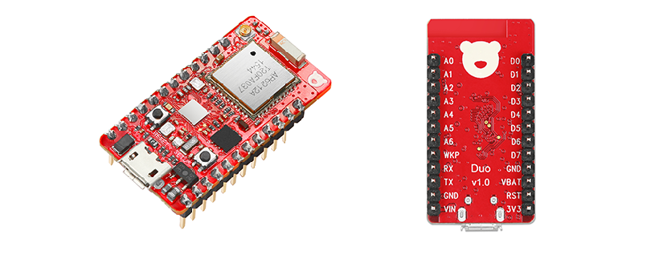

# RedBear Duo
---

* [简介](#简介)
* [特性](#特性)
* [模块组成](#模块组成)
* [引脚分布](#引脚分布)
* [电源](#电源)
* [参考资料](#参考资料)
* [资源下载](#资源下载)
* [封装尺寸](#封装尺寸)
* [Layout建议](#layout建议)
* [购买](#购买)
* [技术支持](#技术支持)

## 简介

RedBear Duo 是由红熊电子（深圳）有限公司（RedBear）研发的一款只有拇指般大小的面向物联网应用的开发板。 它集成了强大的 ARM Cortext-M3 主控芯片、蓝牙双模（同时支持传统蓝牙和蓝牙4.1）与 Wi-Fi 一体化的无线模块， 以及 RGB，LED，按键，2MB SPI Flash，高速USB接口。 该开发板目前已经成功在国外著名的 [Kickstarter](https://www.kickstarter.com/projects/1991736672/redbear-duo-a-small-and-powerful-wi-fi-ble-iot-boa/description) 众筹网站筹到 $104,332 美元。

通过 Duo 开发板，你可以有效地通过蓝牙或者 Wi-Fi 或者同时开启与其他无线设备进行无线连接，比如笔记本电脑、智能手机、平板电脑， 以及其他支持蓝牙或 Wi-Fi 的配件。 但是只支持本地的无线连接已经无法满足物联网应用的需要，Duo 不仅满足了本地蓝牙与 Wi-Fi 的双无线连接需求，更具有强大的云端支持（默认支持 Particle 云），只要 Duo 连上了由具备互联网访问能力的设备（比如路由器、手机、电脑等）广播出来的 Wi-Fi 热点，那么你就可以在世界的另外一个角落联网控制你的 Duo 板，或者读取它采集到的数据。比如，即使你坐在办公室也可以远程控制家里的电器设备，可以检测家里是否有人闯入，可以采集家里的温湿度等环境因素，等等。

如果配合同样由RedBear生产的 [RBLink](rblink_introduction.md) 一起使用，无需任何焊接，你就可以轻松的使用由深圳矽递（[SeeedStudio](https://www.seeedstudio.com/item_list.html?category=45)）提供的各种各样的外设模块。这些模块的驱动完全开源，且简单易用。

对于 Duo 来说，功能不仅强大，而且编程也非常简单以及多样化。不管你是专业的 c/c++ 程序员，还是刚入门的嵌入式爱好者，都可以轻松玩转 Duo。它支持的编程语言有 Arduino、c/c++、 JavaScript 和 Python。 支持的软件开发平台有 Arduino IDE、GCC、在线的 Particle Web IDE、适用于 Javascript 开发者的 Espruino Web IDE，以及 Broadcom 的 WICED SDK。

Duo 可以应用于很多领域，比如：

* 工业自动化
* 楼宇自动化
* 智能家居
* 智能玩具
* 物联网传感器
* Wi-Fi / 蓝牙网关
* Beacon 信标定位

## 特性

* 意法半导体（STMicroelectronics） STM32F205, ARM 32-bit Cortex-M3 @120 MHz
* 正基（AMPAK） AP6212A 无线模块， 基于博通（Broadcom）的 BCM43438 无线芯片:
    - Wi-Fi 802.11b/g/n, 工作在 2.4 GHz ISM 频段
    - 蓝牙 4.1（双模）, 工作在 2.4 GHz ISM 频段
* 存储:
    - 1MB MCU 内部 flash
    - 2MB 外部 SPI flash
    - 128KB MCU内部 SRAM
* 用户接口:
    - 1 x RGB LED
    - 1 x 独立 LED
    - 1 x 复位按键
    - 1 x 用户按键
* 输入输出 （I/O）:
    - 18 路数字输入/输出
    - 8 路模拟输入
    - 2 路模拟输出
    - 13 路脉宽调制输出（PWM）
* 连接性
    - 2 个异步串口（UART）
    - 2 个SPI接口
    - 1 个音频数据传输接口（I2S）
    - 1 个I2C接口 
    - 1 个CAN总线接口
    - 1 个高速 USB 接口
    - JTAG(SWD) 调试接口
* 开发平台: 
    - Arduino IDE
    - Particle Build (Web IDE)
    - Espruino Web IDE
    - Broadcom WICED SDK
    - ARM GCC
* 运行实时嵌入式操作系统 (FreeRTOS)
* 软硬件开源
* 可当模块贴在自己设计的PCB板上
* 可插在面包板上
* 可选择的片上天线或外置天线
* 已通过 FCC 和 CE 验证

## 模块组成

## 引脚分布

## 电源

#### 供电电源

**!!! 注意: 同一时间只能连接一个供电电源给 Duo 供电，否则将会损坏开发板!**

为保证开发板正常工作，开发板的工作电压范围需是 3.0v ~ 3.6v。 如果工作电压低于 3.0v，无线模块无法正常工作；如果工作电压高于 3.6v，那么主控芯片可能会烧毁。 你有三种选择给 Duo 板供电：

**1. 通过 Micro USB 接口供电**

通过一根 Micro USB线，将 Duo 板连接到一个 3.5v ~ 8v的电源或者直接连到电脑，可以让Duo板正常工作。 输入的电压先被板载稳压器降到 3.3v，然后给内部电路供电。此时，VIN 引脚将输出一个接近于USB端输入的电压，3v3 引脚将输出一个 3.3v 的电压。这两个引脚便可以给周边配件供电。

**2. 通过 VIN 引脚供电**

将一个 3.5v ~ 8v 的电源连接到 VIN 引脚，同样可以让 Duo 正常工作。 输入的电压先被板载稳压器降到 3.3v，然后给内部电路供电。此时，3v3 引脚将输出一个 3.3v 的电压，可以用来给周边配件供电。

**3. 通过 3V3 引脚供电**

将一个 3.0v ~ 3.6v 的电源连接到 3v3 引脚，也可以让 Duo 正常工作。该输入电源将直接给内部电路供电而不经过板载稳压器。

#### 备份电源

备份电源需连接到 VBAT 引脚，其供电电压范围为 1.8v ~ 3.6v。备份电源不能作为供电电源，从而不能使 Duo 正常工作。它的作用在于，当供电电源关闭时，备份电源可以保持MCU内部的备份寄存器、备份RAM的内容不丢失，并且维持内部 RTC 正常工作。 所以备份电源可以和一个供电电源同时连接到 Duo 板上而不会损坏板上器件。

## 参考资料

#### 官方文档

* [RBLink 简介](docs/rblink_introduction.md)
* [开箱体验](out_of_box_experience.md)
* [快速入门使用 Arduino IDE](getting_started_with_arduino_ide.md)
* [快速入门使用 Particle Build](getting_started_with_particle_build.md)
* [编程参考手册](programming_reference.md)
* [固件架构概览](firmware_architecture_overview.md)
* [固件及应用程序下载指南](docs/firmware_deployment_guide.md)
* [固件版本历史](docs/system_firmware_changelog.md)
* [Arduino Duo板安装包版本历史](docs/arduino_board_package_changelog.md)
* [Arduino Duo板安装包安装指南](docs/arduino_board_package_installation_guide.md)
* [dfu-util 安装指南](docs/dfu-util_installation_guide.md)
* [Windows 驱动安装指南](docs/windows_driver_installation_guide.md)
* [重新配置Duo板以连接到Particle云端](docs/devices_provisioning_guide.md)
* [故障排除](docs/troubleshooting.md)

#### 第三方文档

* [Particle 在线文档](https://docs.particle.io/guide/getting-started/intro/photon/)
* [Espruino 在线文档](http://www.espruino.com/)
* [MicroPython 在线文档](http://docs.micropython.org/en/latest/pyboard/)

## 资源下载

* [应用例程](https://github.com/redbear/STM32-Arduino/tree/master/arduino/libraries/RedBear_Duo)
* [Arduino IDE](https://www.arduino.cc/en/Main/Software)
* [Particle Build (WebIDE)](https://build.particle.io/)
* [Particle Dashboard](https://dashboard.particle.io/)
* [固件源码](https://github.com/redbear/firmware)
* [JavaScript 解释器源码](https://github.com/redbear/Espruino)
* [Python 解释器源码](https://github.com/redbear/micropython)
* [WICED SDK](https://community.broadcom.com/community/wiced-wifi/wiced-wifi-documentation)
* [WICED SDK 补丁](https://github.com/redbear/WICED-SDK)
* [BTStack 源码](https://github.com/redbear/btstack)
* [原理图](https://github.com/redbear/Duo/tree/master/hardware/schematic)
* [芯片手册](https://github.com/redbear/Duo/tree/master/hardware)
* [FCC & CE 档案](https://github.com/redbear/Duo/tree/master/certs)

## 封装尺寸

## Layout建议

* Dimensions are in millimeters.

## 购买

* [RedBear 官方商店](https://store.redbear.cc/product.html)
* [世界各地代理商](http://redbearlab.com/buy/)

## 技术支持

* [RedBear 讨论区](http://discuss.redbear.cc)
* [Arduino 论坛](https://forum.arduino.cc/)
* [Particle 论坛](https://community.particle.io)
* [Broadcom 社区](https://community.broadcom.com/welcome)
* [Espruino 论坛](http://forum.espruino.com/)
* [MicroPython 论坛](http://forum.micropython.org/)
* [BlueKitchen](https://bluekitchen-gmbh.com/)

## License

Copyright (c) 2016 Red Bear

Permission is hereby granted, free of charge, to any person obtaining a copy of this software and associated documentation files (the "Software"), to deal in the Software without restriction, including without limitation the rights to use, copy, modify, merge, publish, distribute, sublicense, and/or sell copies of the Software, and to permit persons to whom the Software is furnished to do so, subject to the following conditions:

The above copyright notice and this permission notice shall be included in all copies or substantial portions of the Software.

THE SOFTWARE IS PROVIDED "AS IS", WITHOUT WARRANTY OF ANY KIND, EXPRESS OR IMPLIED, INCLUDING BUT NOT LIMITED TO THE WARRANTIES OF MERCHANTABILITY, FITNESS FOR A PARTICULAR PURPOSE AND NONINFRINGEMENT. IN NO EVENT SHALL THE AUTHORS OR COPYRIGHT HOLDERS BE LIABLE FOR ANY CLAIM, DAMAGES OR OTHER LIABILITY, WHETHER IN AN ACTION OF CONTRACT, TORT OR OTHERWISE, ARISING FROM, OUT OF OR IN CONNECTION WITH THE SOFTWARE OR THE USE OR OTHER DEALINGS IN THE SOFTWARE.

