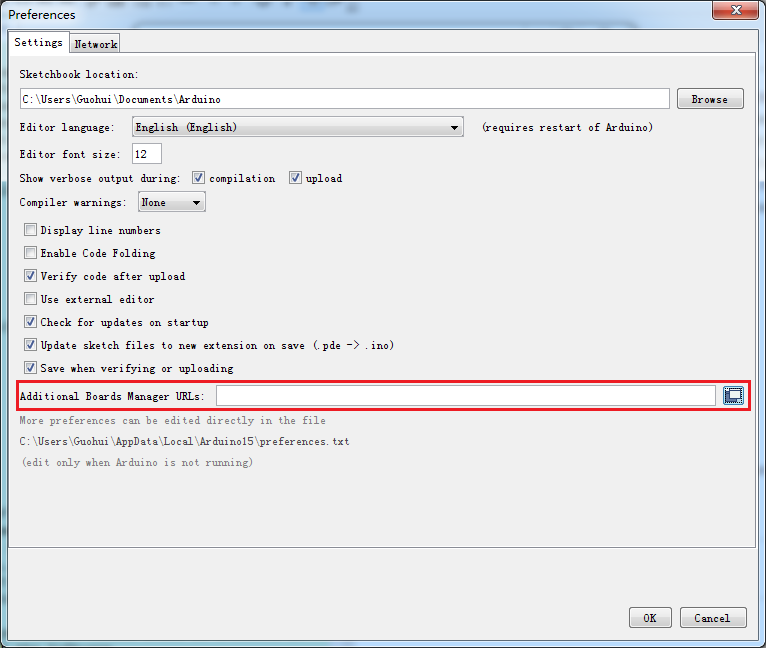
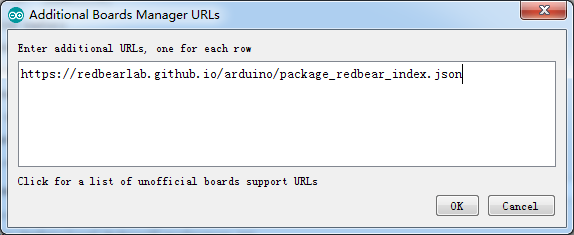
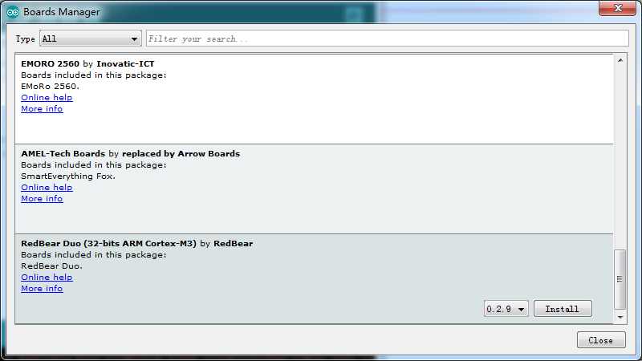
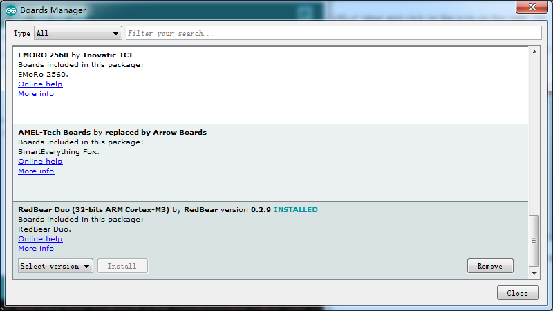
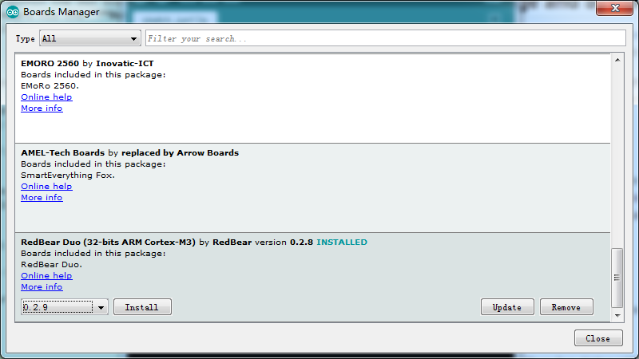

# Duo: Arduino Board Package Installation Guide
---

The RedBear Duo supports developing applications using Arduino IDE v1.6.7 or above. As the Arduino official or third party development boards, you need to install the corresponding board package before you can write your sketch for the target board. Arduino provides a smart and easy way for you to install a board package, i.e. "Boards Manager". 

* [Install Duo Board Package](#install-duo-board-package)
* [Update Duo Board Package](#update-duo-board-package)

## Install Duo Board Package

We assume that you have installed Arduino IDE 1.6.7 or above on your computer, or you have to [download](https://www.arduino.cc/en/Main/Software) and install it first. To install the board package for the Duo board, please walk through the following steps.

1. Start Arduino IDE.

2. Navigate to "File > Preferences"

     

3. Find the "Additional Boards Manager URLs" label and click on the icon on the right. On the pop up window, new a row and fill it with `https://redbearlab.github.io/arduino/package_redbear_index.json`. Click on "OK" to close the preferences window.

     

4. Navigate to "Tools > Board > Boards Manager". Wait until Arduino IDE download the json file we specified before. Then scroll the window to find the RedBear Duo board. Select the version and click on the "Install", it will automatically download and install the board package for the RedBear Duo.

     

5. After the board package installed, you will see the column for RedBear Duo is marked as "INSTALLED". Click on "Close" to shut down the Boards Manager.

     

6. Congratulations! The board package for Duo has been successfully installed. Naviagte to "Tools > Board", you can now select board "**RedBear Duo (Native USB Port)**" if you connect your Duo to computer via its native USB port or, select "**RedBear Duo (RBLink USB Port)**" if you connect the RBLink with Duo moounted on it to computer. Navigate to "File > Examples > RedBear_Duo", you'll see many examples provided for you.

    **Note: If you don't select RedBear Duo as the target board, you won't see the "RedBear_Duo" listed under "File > Examples".**

You are now ready to use the built-in examples or code your own sketch to compile and upload it to your Duo!

## Update Duo Board Package

Since you have installed a version of the Duo board package already, so updating the package becomes much simple.

1. Navigate to "Tools > Board > Boards Manager". Wait until Arduino IDE updates the boards index. 

2. Scroll the window to find the RedBear Duo board. Select an upper version and click on the "Update", it will automatically download and install the  selected version of the board package.

     

3. After the board package updated, click on "Close" to shut down the Boards Manager.

## What's Next

[Getting Started with Arduino IDE](getting_started_with_arduino_ide.md)

## References

* [Duo Introduction](duo_introduction.md)
* [Arduino Board Package Change-log](arduino_board_package_changelog.md)
* [Arduino Official Website](http://www.arduino.cc/)
* [Arduino Unofficial List of 3rd Party Boards Support URLs](https://github.com/arduino/Arduino/wiki/Unofficial-list-of-3rd-party-boards-support-urls)
* [RedBear Discussion Forum](http://discuss.redbear.cc/)

## Resources

* [Arduino Board Package Source Code](https://github.com/redbear/STM32-Arduino/tree/master/arduino)
* [Arduino IDE](https://www.arduino.cc/en/Main/Software)

## License

Copyright (c) 2016 Red Bear

Permission is hereby granted, free of charge, to any person obtaining a copy of this software and associated documentation files (the "Software"), to deal in the Software without restriction, including without limitation the rights to use, copy, modify, merge, publish, distribute, sublicense, and/or sell copies of the Software, and to permit persons to whom the Software is furnished to do so, subject to the following conditions:

The above copyright notice and this permission notice shall be included in all copies or substantial portions of the Software.

THE SOFTWARE IS PROVIDED "AS IS", WITHOUT WARRANTY OF ANY KIND, EXPRESS OR IMPLIED, INCLUDING BUT NOT LIMITED TO THE WARRANTIES OF MERCHANTABILITY, FITNESS FOR A PARTICULAR PURPOSE AND NONINFRINGEMENT. IN NO EVENT SHALL THE AUTHORS OR COPYRIGHT HOLDERS BE LIABLE FOR ANY CLAIM, DAMAGES OR OTHER LIABILITY, WHETHER IN AN ACTION OF CONTRACT, TORT OR OTHERWISE, ARISING FROM, OUT OF OR IN CONNECTION WITH THE SOFTWARE OR THE USE OR OTHER DEALINGS IN THE SOFTWARE.