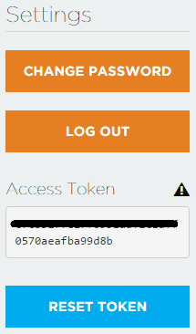

# Duo: Devices Provisioning Guide
---

This Guide is only useful for those users want to connect to the Particle Cloud.

## Preliminary Knowledge 

**Convention: All the "cloud" mentioned below is referred to the Particle Cloud**

#### About the keys

The communication between Duo and the cloud is truely secure. There are three keys stored in the DCT(Device Configuration Table): **cloud server public key**, **device private key** and **device public key**. The cloud server public key can be obtained from Particle (or a [backup](https://github.com/redbear/Duo/tree/master/firmware/dct) from RedBear) and has been programmed into DCT during manufacture. The device private key is generated when the first time power on the Duo and then is stored in the DCT. The device public key will be generated according to the device private key when it is requested by the cloud server and then is stored in the DCT. 

#### What does provisioning do?

Provision your Duo so that the next time it attempts to connect to the cloud, the cloud will feel FREE to accept the connection and then request for the Duo's device public key that generated according to the device private key in the DCT. Once the device public key is submitted to the cloud, it will not change on the cloud, unless you provisioning your Duo again.

#### Why need provisioning?

The cloud connections initiated by the Duo will be established only if the device private key in the DCT and the device public key on the cloud are in pairs. If each of them is modified or destroyed, e.g.,

* The device private key in the DCT is destroyed by accident, but you don't have a backup
* The device public key is destroyed or lost on the cloud
* You don't trust RedBear and want to re-generate the device private key

your Duo will never able to cnnect to the cloud. 

**That's why we highly recommend that you backup the device private key after your Duo connected to the Particle Cloud successfully. Even if the device private key is destroied, you can simply load the backup key to the DCT without provisioning your Duo(See [dfu-util Installation Guide](dfu-util_installation_guide.md))**:

    $ dfu-util -d 2b04:d058 -a 1 -s 34 -D device_private_key.der

#### Why need initial provisioning

Every Duo should be provisioned in an authorised admin account (initial provisioning) once at least during manufacture. The initial provisioning is not only to provision your Duo, but also to add your Duo to the cloud device database. That's why your Duo can connect to the cloud at its first attempt after you received the Duo. Without the initial provisioning, your Duo will never able to connet to the cloud, neither you can provision the Duo by yourself. 

As there is always a chance that certain Duos may escape from the initial provisioning before shipped out, when you try provisioning your Duo and get the error "**permission denied**", send your Duo's device ID to [guohui@redbear.cc]() and we'll help process the initial provisioning.

## Generate New Device Private Key

* Please follow the [dfu-util Installation Guide](dfu-util_installation_guide.md) to install the dfu-util first.  

* Make your Duo enter DFU Mode:

    - Hold down BOTH buttons
    - Release only the RESET button, while holding down the SETUP button.
    - Wait for the LED to start blinking **yellow**
    - Release the SETUP button

* Download the [reset\_device\_private\_key.bin](https://github.com/redbear/Duo/raw/master/firmware/dct/reset_device_private_key.bin) and load it to DCT using dfu-util to reset the device private key:

        $ dfu-util -d 2b04:d058 -a 1 -s 34:leave -D reset_device_private_key.bin

* After the command executed, your Duo will leave the DFU Mode and reset to **blink white**, which means it is generating a new device private key. Once the key is generated and stored in the DCT, it will reset again and then every thing as usual.

## Provisioning

**Note: If you have trouble provisioning your Duo by yourself, please send your Duo's device ID to us (guohui@redbear.cc), we'll help provision it for you.**

* Download and install the [Nodejs](https://nodejs.org/en/download/) on your computer.

* Download or clone the [device-provisioning-helper](https://github.com/redbear/device-provisioning-helper) script from GitHub.

* Install related modules:

        $ cd device-provisioning-helper
        $ npm install

* Get your access token to the cloud. Log into your Particle account, from the "**Settings**" icon, copy the "**Access Token**".

    

* Edit the `main.js` under the `device-provisioning-helper` folder. Change  the `YOUR_ACCESS_TOKEN` to your own and change the `YOUR_PRODUCT_ID` to `88`, which assigned by Particle. E.g.:

		var YOUR_ACCESS_TOKEN = "xxxxxxxxxxxxxxxxxxxxxxxxx0570aeafba99d8b";
		var YOUR_PRODUCT_ID = 88;

* Run the following command to provision your Duo:

	    $ node main.js YOUR_DEVICE_ID

    Sample output:

	    using generic public key
	    attempting to add a new public key for device 2fff27fffc473530fff23637
	    Success - Device Provisioned!

* If provisioning succeed, the next time your Duo attempts to connect to the cloud will also succeed as expected.

## What's Next

[Getting Started with Particle Build (WebIDE)](getting_started_with_particle_build.md)

## References

* [Duo Introduction](duo_introduction.md)
* [Out-of-Box Experience](out_of_box_experience.md)
* [dfu-util Installation Guide](dfu-util_installation_guide.md)
* [RedBear Discussion Forum](http://discuss.redbear.cc/)

## Resources

* [device-provisioning-helper](https://github.com/redbear/device-provisioning-helper)
* [Nodejs](https://nodejs.org/en/download/)

## License

Copyright (c) 2016 Red Bear

Permission is hereby granted, free of charge, to any person obtaining a copy of this software and associated documentation files (the "Software"), to deal in the Software without restriction, including without limitation the rights to use, copy, modify, merge, publish, distribute, sublicense, and/or sell copies of the Software, and to permit persons to whom the Software is furnished to do so, subject to the following conditions:

The above copyright notice and this permission notice shall be included in all copies or substantial portions of the Software.

THE SOFTWARE IS PROVIDED "AS IS", WITHOUT WARRANTY OF ANY KIND, EXPRESS OR IMPLIED, INCLUDING BUT NOT LIMITED TO THE WARRANTIES OF MERCHANTABILITY, FITNESS FOR A PARTICULAR PURPOSE AND NONINFRINGEMENT. IN NO EVENT SHALL THE AUTHORS OR COPYRIGHT HOLDERS BE LIABLE FOR ANY CLAIM, DAMAGES OR OTHER LIABILITY, WHETHER IN AN ACTION OF CONTRACT, TORT OR OTHERWISE, ARISING FROM, OUT OF OR IN CONNECTION WITH THE SOFTWARE OR THE USE OR OTHER DEALINGS IN THE SOFTWARE.

