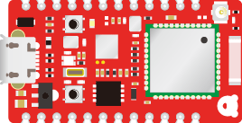
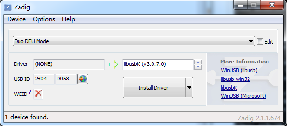
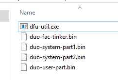

# DFU Installation Guide

[dfu-util](http://dfu-util.sourceforge.net/) is a tool for Device Firmware Upgrade to the Duo via the USB port.

### Enter DFU Mode

* Connect the Duo to your computer via the USB port.

* Press and hold the 'SETUP' button and then press the 'RESET' button, release the 'SETUP' button once you see the RGB is flashing in yellow color.

	 

### Windows

* To use dfu-util, you need to download an USB library driver for the Duo, we make use of [Zadig](http://zadig.akeo.ie/) to install quickily. There is an [usage guide](https://github.com/pbatard/libwdi/wiki/Zadig) provided.

* Run Zadig after downloading and in the following screen, press the 'Install Driver' button.

	 
	
* Download the [dfu-util](http://dfu-util.sourceforge.net/releases/dfu-util-0.8-binaries/win32-mingw32/dfu-util-static.exe).

* Start 'Command Prompt' and navigate to the folder you downloaded the dfu-util

* Rename it to dfu-util.exe

		c:\> ren dfu-util-static.exe dfu-util.exe

* Suggest you to put the dfu-util.exe to your downloaded Duo firmware folder.

	

### OSX

* Install [brew](http://brew.sh/) or start the Terminal to install it directly:

		$ ruby -e "$(curl -fsSL https://raw.githubusercontent.com/Homebrew/install/master/install)"

* In the Teminal, type this command to install the dfu-util:

		$ brew install dfu-util

### Linux

* Download the [dfu-util](http://dfu-util.sourceforge.net/releases/dfu-util-0.8-binaries/linux-i386/).
	
* Suggest you to put the dfu-util.exe to your downloaded Duo firmware folder.

### Check Version

* Type in command line box:
		
		$ dfu-util --version

* Sample output:

		dfu-util 0.8

		Copyright 2005-2009 Weston Schmidt, Harald Welte and OpenMoko Inc.
		Copyright 2010-2014 Tormod Volden and Stefan Schmidt
		This program is Free Software and has ABSOLUTELY NO WARRANTY
		Please report bugs to dfu-util@lists.gnumonks.org
