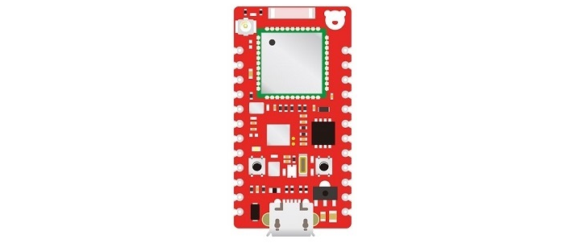
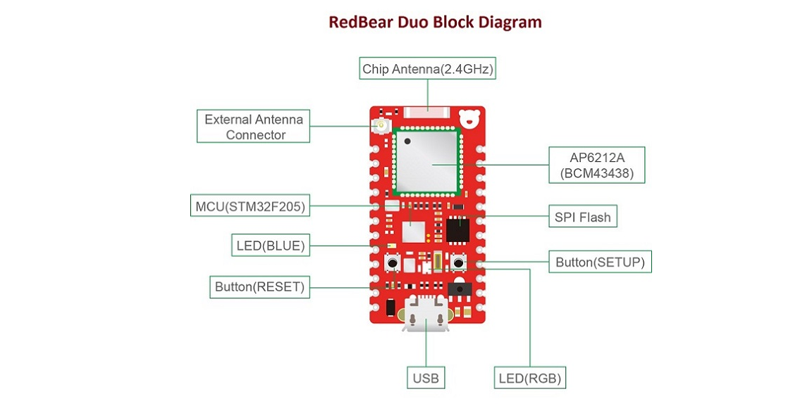
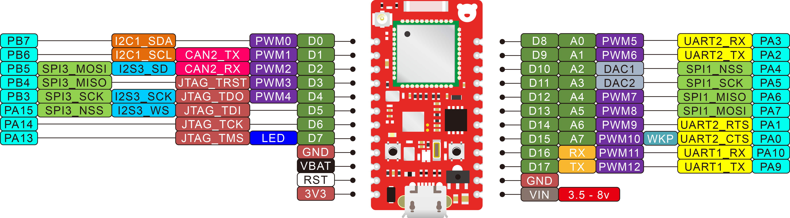
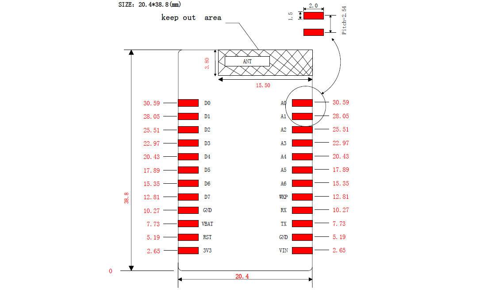
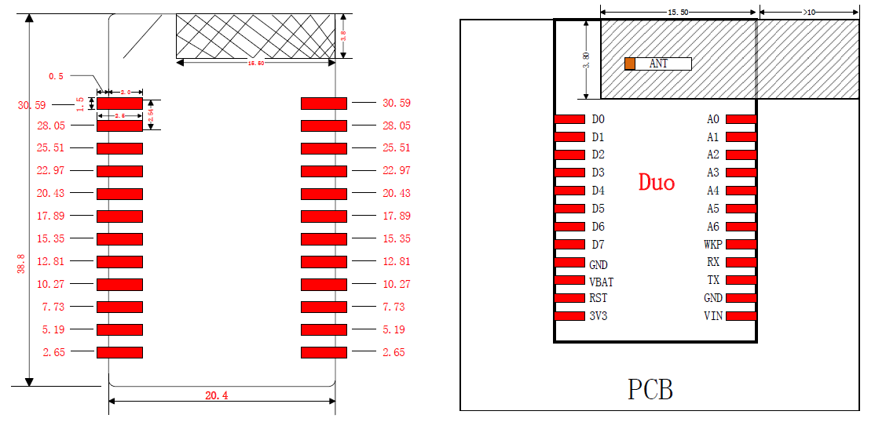

# RedBear Duo Introduction
---

* [Description](#description)
* [Features](#features)
* [Block Diagram](#block-diagram)
* [Pinout](#pinout)
* [Power Supply](#power-supply)
* [Development](#development)
* [Package Characteristics](#package-characteristics)
* [Layout Recommendations](#layout-recommendations)
* [Ordering Information](#ordering-information)
* [Resources](#resources)

## Description

The [RedBear Duo](http://www.redbear.cc/duo) is a thumb-size development board designed to simplify the process of building Internet of Things (IoT) products. It is built with a powerful Cortext-M3 MCU, a wireless module which equips both Wi-Fi and BLE (Bluetooth Low Energy) connectivity, as well as abundant of peripherals. 

It enables you develop applications to communicate with other wireless accessories or your smart devices, e.g. mobile phone, tablet or computer, through BLE, Wi-Fi or both BLE and WiFi at the same time. If the Duo is connecting to a router which implemented internet capability, you can even communicate with the Duo through cloud. For example, you can just sit in your office and monitor the environment data sampled by the Duo at home.

The Duo supports several kinds of programming language, particularly like Arduino, C/C++, JavaScript and Python. You can develop the applications for Duo using GCC, Arduino IDE, Particle Web IDE, Espruino Web IDE and Broadcom WICED SDK.

The Duo is so powerful that you can be applied it many applications, e.g.:

* Industrial Automation
* Building Automation
* Smart Home Appliances
* Smart Toys
* IoT Enabled Sensors
* WiFi / BLE Gateway
* Beacon Management

## Features

* STMicroelectronics STM32F205, ARM 32-bit Cortex-M3 @120 MHz
* AMPAK AP6212A Wireless Module (built around Broadcom BCM43438):
    - Wi-Fi 802.11b/g/n, working on 2.4 GHz ISM Band
    - Bluetooth 4.1 (Dual Mode), working on 2.4 GHz ISM Band
* Memories:
    - 1MB internal flash
    - 2MB external SPI flash
    - 128KB SRAM
* User Interface:
    - 1 x RGB LED
    - 1 x single LED
    - 1 x RESET button 
    - 1 x user button
* 18 x Digital I/O
* 8 x Analog Input
* 13 x PWM
* Connectivity
    - 2 x UART
    - 2 x SPI
    - 1 x I2S
    - 1 x I2C 
    - 1 x High Speed USB
    - JTAG(SWD) debug port
* Development Platform: 
    - Arduino IDE
    - Particle Build(WebIDE)
    - Espruino WebIDE
    - Broadcom WICED SDK
    - ARM GCC
* Real-time operating system (FreeRTOS)
* Hardware and software open source
* Single-sided PCBA for easy mounting on other PCB
* Alternative signal chip antenna or external antenna
* FCC and CE certified

## Block Diagram

Pinout
## 

## Power Supply

Operating voltage: 3.3v

## Development

* [Out-of-Box Experience](out_of_box_experience.md)
* [Getting Started with Arduino IDE](getting_started_with_arduino_ide.md)
* [Getting Started with Particle Build]()
* [Applications Development Guide](applications_development_guide.md)
* [Firmware Architecture Overview](firmware_architecture_overview.md)
* [RedBear discussion forum](http://discuss.redbear.cc/)

## Package Characteristics

## Layout Recommendations

* Dimensions are in millimeters.

## Ordering Information

* [RedBear Store](https://store.redbear.cc/product.html)
* [Worldwide Resellers](http://redbearlab.com/buy/)

## Resources

* [Modified Particle firmware source code](https://github.com/redbear/firmware)
* [Arduino board package for Duo](https://github.com/redbear/STM32-Arduino)
* [Modified Espruino source code](https://github.com/redbear/Espruino)
* [Modified MicroPython source code](https://github.com/redbear/micropython)
* [WICED SDK patch for Duo](https://github.com/redbear/WICED-SDK)
* [BTStack source code](https://github.com/redbear/btstack)
* [RedBear Duo schematic](https://github.com/redbear/Duo/tree/master/hardware/schematic)
* [Components datasheet](https://github.com/redbear/Duo/tree/master/hardware/datasheets)
* [FCC & CE certification](https://github.com/redbear/Duo/tree/master/certs)

## License

Copyright (c) 2016 Red Bear

Permission is hereby granted, free of charge, to any person obtaining a copy of this software and associated documentation files (the "Software"), to deal in the Software without restriction, including without limitation the rights to use, copy, modify, merge, publish, distribute, sublicense, and/or sell copies of the Software, and to permit persons to whom the Software is furnished to do so, subject to the following conditions:

The above copyright notice and this permission notice shall be included in all copies or substantial portions of the Software.

THE SOFTWARE IS PROVIDED "AS IS", WITHOUT WARRANTY OF ANY KIND, EXPRESS OR IMPLIED, INCLUDING BUT NOT LIMITED TO THE WARRANTIES OF MERCHANTABILITY, FITNESS FOR A PARTICULAR PURPOSE AND NONINFRINGEMENT. IN NO EVENT SHALL THE AUTHORS OR COPYRIGHT HOLDERS BE LIABLE FOR ANY CLAIM, DAMAGES OR OTHER LIABILITY, WHETHER IN AN ACTION OF CONTRACT, TORT OR OTHERWISE, ARISING FROM, OUT OF OR IN CONNECTION WITH THE SOFTWARE OR THE USE OR OTHER DEALINGS IN THE SOFTWARE.
