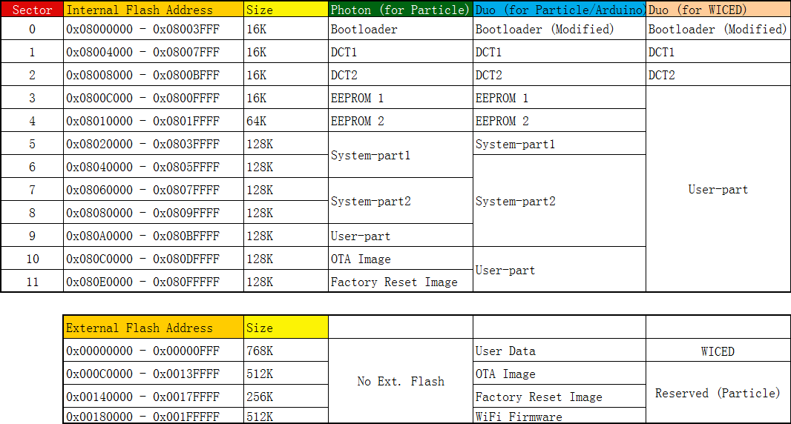

# Duo Memory Mapping
---

The RedBear Duo supports running Particle firmware based applications and WICED SDK based applications. It is installed the customed Particle firmware by default during manufacturing. The following diagram exactly shows you the memory mapping on the Duo, comparing to the Particle Photon development board.

The Duo's memory allocation is different from the Photon. The Duo has an external flash while the Photon does not. The external flash stores the WiFi firmware to be loaded to the BCM43438 wirless chip during boot-up as well as other recovery firmware. Thus, this design allows the entire internal flash memory space of 256KB to be available for the user sketch.

## Bootloader

The Duo MCU boots from the internal memory address 0x08000000, where the bootloader is located. The bootloader keeps track of the firmware and provides functions to flash firmware via the USB port (e.g. DFU Mode). If it has nothing to do during the boot time, it will pass the control to system part 1.

The bootloader cannot be updated using dfu-util, instead, it will be updated by the partition 2 firmware.

The partition 2 has a copy of bootloader, if it found the bootloader version is lower then the copy, it will update the bootloader partition actomatically.

If you have removed the bootloader with other code (or maybe other bootloader for the ST F205 MCU), you can reload the Duo bootloader by using the RBLink. If you do not have a RBLink, you can use JLink, STLink, FTDI or other flash programmer, but here we will just support using the RBLink.

## DCT (Device Configuration Table)

Device Configuration Table (DCT), is a non-volatile flash storage space for storing board configuration such as WiFi credentials (SSID, PIN, etc.).

## Simulate EEPROM

EEPROM 1 & 2 is to use flash memory to simulate EEPROM for user storage.

## System Part 1 & 2

The Duo firmware is modular in structure, as dynamic libraries (dynalib) and are stored in the system partitions of the internal flash memory.

System Part 1 is for storing communication/security dynalib that used for connecting the Duo to the Particle cloud. Originally, for the Photon, the WiFi firmware is stored here but for the Duo, it is not.

Basically, there is no code to be run in partition 1 and it just passes the control to partition 2.

System Part 2 performs a lot of tasks, firstly, it checks the WiFi firmware stored in the external flash and loads it into the AP6216A module (BCM43438 chip). Then it will start BLE and WiFi for doing WiFi provisioning if it has not connected before, otherwise, it will try to associate to a known Wireless Access Point (e.g. home router). Finally, it will connect to the Particle cloud as well.

The partition 2 firmware has a copy of bootloader, if it found the bootloader version is lower than the copy, then it will update the bootloader automatically.

When everything is ready, it will pass the control to the user partition (your own firmware), `setup()` and `loop()`.

## User Part

## OTA Image

## Factory Reset Image

## Wi-Fi Firmware

## References

## License

Copyright (c) 2016 Red Bear

Permission is hereby granted, free of charge, to any person obtaining a copy of this software and associated documentation files (the "Software"), to deal in the Software without restriction, including without limitation the rights to use, copy, modify, merge, publish, distribute, sublicense, and/or sell copies of the Software, and to permit persons to whom the Software is furnished to do so, subject to the following conditions:

The above copyright notice and this permission notice shall be included in all copies or substantial portions of the Software.

THE SOFTWARE IS PROVIDED "AS IS", WITHOUT WARRANTY OF ANY KIND, EXPRESS OR IMPLIED, INCLUDING BUT NOT LIMITED TO THE WARRANTIES OF MERCHANTABILITY, FITNESS FOR A PARTICULAR PURPOSE AND NONINFRINGEMENT. IN NO EVENT SHALL THE AUTHORS OR COPYRIGHT HOLDERS BE LIABLE FOR ANY CLAIM, DAMAGES OR OTHER LIABILITY, WHETHER IN AN ACTION OF CONTRACT, TORT OR OTHERWISE, ARISING FROM, OUT OF OR IN CONNECTION WITH THE SOFTWARE OR THE USE OR OTHER DEALINGS IN THE SOFTWARE.

