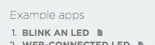

# Getting Started - RedBear Duo

Congratulations on being the owner of a brand new [RedBear Duo](http://www.redbear.cc/duo)! Now, you can open the box and follow this guide to play with the Duo.

This getting started guide will show you how to use the RedBear Duo IoT development board quickily. There are two topics:

1. Out of the box test
2. Develop an application using WebIDE or Arduino IDE.

## Prerequisites for Setup

You need to prepare the following hardware items:

1. PC with Windows, Linux (e.g. Ubuntu) or Mac with OSX
	* Tested on: Windows 10, OSX 10.11
2. Access Point (e.g. an Internet router at your home).
	* For the Duo to have Internet connection
3. Micro USB cable
	* Note: some cables only for power, you need a data+power cable for the Duo.

Software items:
	
1. [dfu-til](http://dfu-util.sourceforge.net/)
2. Latest Duo Firmware
	* https://github.com/redbear/Duo/raw/master/firmware/
	 
For Windows, you also need the following software tools:

1. [PuTTY](http://www.chiark.greenend.org.uk/~sgtatham/putty)
	* or you can use other serial port tool (e.g. HyperTerminal)
2. [Driver](https://github.com/redbear/Duo/raw/master/driver/windows/duo_win_driver.zip)
3. [Zadig](http://zadig.akeo.ie/)

## Out of the Box Test

#### 1. Power-Up the Duo

* Connect the Duo to your PC via the USB port with a micro USB cable.

* The RGB LED will show Blue in color and keep flashing (i.e. Listening Mode).

	

#### 2. Install Driver (Only required for Windows)

* Follow [this driver](driver.md) installation guide for details.

#### 3. Install PuTTY (Only required for Windows)

* Note: you can also use other Serial port communication software (e.g. HyperTerminal).

* Download and unzip [PuTTY](http://the.earth.li/~sgtatham/putty/latest/x86/putty.zip).

#### 4. Check firmware version and device ID

##### For Windows

* Start PuTTY, change the Serial port to your one and press the 'Open' button.

	

	* Press 'v' to the terminal screen, you will see the firmware version.
	
	* Press 'i', you will see the Device ID of the Duo.
	
	
	
##### For OSX or Linux

* Start the Terminal and use 'screen' command.
	
	* For example on OSX, start
		
		
	
	* Type:
	
			$ screen /dev/tty.usbmodemXXXXX
		
			where XXXXX is your Duo device serial port.
	
	* Press 'v' to the terminal screen, you will see the firmware version.
	
	* Press 'i', you will see the Device ID of the Duo.

	* It will show something like the following lines:
	
			system firmware version: 0.1.1

			Your device id is 200027FFFc473530FFF23637

#### 5. Updating Firmware

* Follow this [DFU](dfu.md installation guide) to install the 'dfu-util' tool.

* Download the zipped Duo firmware (latest version) and unzip it to a folder.
	
	* https://github.com/redbear/Duo/raw/master/firmware/
	
* Start the Command Prompt (Windows) or Terminal (OSX)
	
* If you are not in the DFU Mode, press and hold the 'SETUP' button on the Duo and then press reset button, when the RGB LED shows yellow and flashing, release the 'SETUP' button, the Duo will enter the DFU Mode.
	
	 
	
* From the command line box:

			To update System-Part1, type:

			$ dfu-util -d 2b04:d058 -a 0 -s 0x08020000 -D duo-system-part1.bin

			To update System-Part2, type:

			$ dfu-util -d 2b04:d058 -a 0 -s 0x08040000 -D duo-system-part2.bin

			To update User-Part, type:

			$ dfu-util -d 2b04:d058 -a 0 -s 0x080C0000 -D duo-user-part.bin
	
			To update factory reset image, type:

			$ dfu-util -d 2b04:d058 -a 2 -s 0x140000 -D duo-fac-tinker.bin

* Sample output:

		dfu-util 0.8

		Copyright 2005-2009 Weston Schmidt, Harald Welte and OpenMoko Inc.
		Copyright 2010-2014 Tormod Volden and Stefan Schmidt
		This program is Free Software and has ABSOLUTELY NO WARRANTY
		Please report bugs to dfu-util@lists.gnumonks.org

		dfu-util: Invalid DFU suffix signature
		dfu-util: A valid DFU suffix will be required in a future dfu-util release!!!
		Opening DFU capable USB device...
		ID 2b04:d058
		Run-time device DFU version 011a
		Claiming USB DFU Interface...
		Setting Alternate Setting #0 ...
		Determining device status: state = dfuIDLE, status = 0
		dfuIDLE, continuing
		DFU mode device DFU version 011a
		Device returned transfer size 4096
		DfuSe interface name: "Internal Flash   "
		Downloading to address = 0x08020000, size = 38492
		Download	[=========================] 100%        38492 bytes
		Download done.
		File downloaded successfully	
		
* After updating the firmware, press the onboard 'RESET' button to run the new firmware.

* Repeat the step 4 again to check the new firmware version.

		system firmware version: 0.2.1

		Your device id is 200027FFFc473530FFF23637

* For more details about the Duo firmware, refer to the [Firmware](../firmware/README.md) folder.

* Now, please write down the device ID, it is required to do registration on Particle website in order to use their Cloud service and online Web IDE for firmware development.

#### 6. Setup WiFi

* Assume you are still in the 'Listening Mode' (i.e. RGB LED in [flashing blue](images/Duo-Blue.gif))

* Connect to the Duo using 'PuTTY' tool or 'screen' command.

* Type 'w', it will ask you to enter the SSID, Security type and password to associate to your AP (or your Internet router).

* Sample input and output:

		system firmware version: 0.2.1

		Your device id is 200027000c47353033323637
		SSID: AP-01
		Security 0=unsecured, 1=WEP, 2=WPA, 3=WPA2: 3
		Password: YOUR_PIN_ONLY_YOU_KNOW
		Thanks! Wait while I save those credentials...

		Awesome. Now we'll connect!

		If you see a pulsing cyan light, your device
		has connected to the Cloud and is ready to go!

		If your LED flashes red or you encounter any other problems,
		visit https://www.particle.io/support to debug.

	    Particle <3 you!

* If everything is ready, it will try to connect your AP and the RGB will flash in Green and then change to Cyan. RGB Color Status:
		
		Flashing Green	: Try to connect the AP you entered.
		Breathing Green	: Connected to the AP.
		Flashing Cyan	: Trying to connect to the Particle Cloud.
		Breathing Cyan	: Connected to the Cloud.

#### 7. Testing

* Now, you can test the board. The user part firmware is a Web Server and there a mDNS service running.

* Reset your board and then use 'PuTTY' or 'screen' to connect it.

* The [WebServer Firmware](https://github.com/redbear/STM32-Arduino/blob/master/arduino/libraries/RedBear_Duo/examples/01.Basics/Duo_WebServer/Duo_WebServer.ino) will ask your router for an IP address via DHCP and it will show the following message to the USB CDC (serial) port:

		Arduino sketch started.

		Note: If your Duo hasn't stored a valid WiFi profile, it will enter the listening mode for provisioning first.

		Waiting for an IP address...

		Duo's web server IP Address: 192.168.1.11 
 
		Make sure your smart device acting as web client is connecting to the same AP as Duo.
		Then open the web browser on your smart device and enter the Duo's web server IP address.
 
		setService
		mdns.begin
		mdns/setup success

* Try to use a Web Browser (e.g. Safari or Chrome) to browse the Web Server. If your browser support mDNS, you can just type 'duo.local' as the URL. Otherwisw, type 'http://192.168.1.11' as an example.

	* Note: this is a sample IP address, it should be your own IP address displayed in the 'PuTTY' or 'screen'.
	
	

* Press the 'HIGH' or 'LOW' button to see any effect on your Duo's blue LED.

## WebIDE

* Make sure you are connected to the Cloud (RGB in breathing cyan).

* From you PC, start a Web Browser, navigate to [Particle](https://build.particle.io) build website.

* Create a Particle account if you do not have one.

* Bottom left corner, there is an icon - Devices, click it

	

* And then press 'ADD NEW DEVICE'.

	
	
* Enter your device ID to the box to claim your Duo.

	

* Give a name to your Duo and then press the 'save' button.

	
	
* Your Duo will be listed in 'Other Devices', refresh the whole page, you will see it correctly. The cyan dot means it is online.

	

* Now, try to load the Blink example and flash it to your Duo over the Cloud.

	
	
	

* Great job! Finally, you can start your own innovative projects!

## Arduino IDE

Follow [this](https://github.com/redbear/STM32-Arduino) to use Arudino IDE for programming.

## 

Copyright (c) 2016 Red Bear, All Rights Reserved.