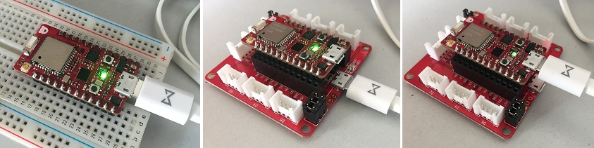
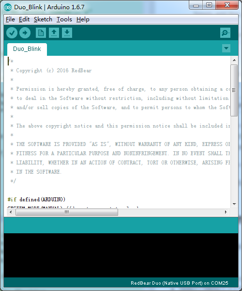

# Duo: Getting Started with Arduino IDE
---

The Duo is installed the customed Particle firmware by default during manufacturing, which enables you developing applications using Arduino IDE. You can directly connect your Duo to computer via its native USB port or, mount your Duo onto RBLink and connect the RBLink to computer via RBLink USB port.

* [Requirements](#requirements)
* [Essential Setup](#essential-setup)
* [Update System Firmware](#update-system-firmware)
* [First Simple Application](#first-simple-application)

## Requirements

* Arduino IDE v1.6.7 or above
* RedBear Duo development board
* RBLink programmer (optional)
* Micro USB cable 

## Essential Setup

1. Connect the Duo dierectly to your computer via its native USB port with micro USB cable. Alternatively, if you have a RBLink in hand, you can mount the Duo onto your RBLink and connect the RBLink to your computer via RBLink USB port with micro USB cable. It's fine you connect the Duo directly to computer while it is mounted onto RBLink.

    

2. (**Windows Only**) Install USB driver. If you connect the Duo directly to computer, then install the Duo application USB driver and the Duo DFU USB driver. If you connect the  RBLink to computer, then install the RBLink USB driver. Please follow the [Windows Driver Installation Guide](windows_driver_installation_guide.md) to install those drivers if you havn't done it before.

3. Download and install the corresponding Arduino IDE 1.6.7 or above for the Operating System of your computer.

4. Start Arduino IDE. Please follow the [Arduino Board Package Installation Guide](arduino_board_package_installation_guide.md) to install the board package for Duo.

5. (**Linux Only**) Configure development environment

    - Update UDEV rules

        For Linux (e.g. Ubuntu 14.04) users: Modem Manager will try to use the Duo as a modem, which will cause the upload process fail using Arduino IDE. To allow Arduino IDE to upload correctly, you need to fix it by modifying the UDEV rule -- write a simple UDEV rule to ignore it from being handled by modem manager.

	        $ sudo nano /etc/udev/rules.d/77-mm-usb-device-blacklist.rules
	
        Simply add this single line:

	        ATTR{idVendor}=="2b04", ENV{ID_MM_DEVICE_IGNORE}="1"

    - Install lsb-core

        On Linux, if you cannot compile sketches because of the gcc or g++ not being found by Arduino IDE:

	        $ sudo apt-get install lsb-core

## Update System Firmware

You are supposed to check the [board package change-log](duo_arduino_board_package_changelog.md) to see if there is a new released version of the board package. If available, you can simply follow the [Arduino Board Package Installation Guide](arduino_board_package_installation_guide.md) to update the board package to the latest version. 

Since Duo board package v0.2.5, there is always a copy of the Duo's system firmware within the package. According to the board package change-log, it declares which version of the system firmware that should be compatible with applications developed based on the corresponding board package. If you've worked through the [Out-of-Box Experience](out_of_box_experience.md), you should have known the system firmware version of your Duo. If not, 

* Connect your Duo **directly** to computer.
* Navigate to "Tools > Port", select the port for the Duo.
* Open the "Serial Monitor" at the top-right corner of Arduino IDE.
* Send the lowercase '**v**', the Duo will echo its system firmware version:

    

If your Duo's current system version is not the same as the one declared in the board package you've installed, you'd better follow the section "**Using Arduino IDE**" of the [Firmware Deployment Guide](firmware_deployment_guide.md), to update the system firmware for your Duo. 

## First Simple Application
1. Navigate to "Tools > Board", select the "**RedBear Duo (Native USB Port)**" as the target board if you connect the Duo via its native USB port, or select "**RedBear Duo (RBLink USB Port)**" if you connect the RBLink with the  Duo mounted onto it.

2. Navigate to "Tools > Port", select the port for the Duo or RBLink.

3. Navigate to "File > Examples > RedBear_Duo > 01.Basic", select "**Duo\_Blink**" to open the example.

    

4. Click on the  icon to compile the sketch followed by automatically uploading this sketch to your Duo. After uploadling completed, you will see the on-board blue LED is toggling in every second interval.

5. Well done! You could try more other examples that under "File > Examples > RedBear_Duo" or, just start coding your own sketch to build an awesome project!

## References

* [Duo Introduction](duo_introduction.md)
* [Arduino/C/C++ Programming Reference Manual](programming_reference_manual.md)
* [How It Works](how_it_works.md)
* [Arduino Board Package Installation Guide](arduino_board_package_installation_guide.md)
* [Arduino Board Package Change-log](https://github.com/redbear/STM32-Arduino/blob/master/CHANGELOG.md)
* [Firmware Architecture Overview](firmware_architecture_overview.md)
* [Arduino Official Website](http://www.arduino.cc/)
* [RedBear Discussion Forum](http://discuss.redbear.cc/)

## Resources

* [Modified Particle firmware Source Code](https://github.com/redbear/firmware)
* [Arduino Board Package Source Code](https://github.com/redbear/STM32-Arduino/tree/master/arduino)
* [Arduino IDE](https://www.arduino.cc/en/Main/Software)

## License

Copyright (c) 2016 Red Bear

Permission is hereby granted, free of charge, to any person obtaining a copy of this software and associated documentation files (the "Software"), to deal in the Software without restriction, including without limitation the rights to use, copy, modify, merge, publish, distribute, sublicense, and/or sell copies of the Software, and to permit persons to whom the Software is furnished to do so, subject to the following conditions:

The above copyright notice and this permission notice shall be included in all copies or substantial portions of the Software.

THE SOFTWARE IS PROVIDED "AS IS", WITHOUT WARRANTY OF ANY KIND, EXPRESS OR IMPLIED, INCLUDING BUT NOT LIMITED TO THE WARRANTIES OF MERCHANTABILITY, FITNESS FOR A PARTICULAR PURPOSE AND NONINFRINGEMENT. IN NO EVENT SHALL THE AUTHORS OR COPYRIGHT HOLDERS BE LIABLE FOR ANY CLAIM, DAMAGES OR OTHER LIABILITY, WHETHER IN AN ACTION OF CONTRACT, TORT OR OTHERWISE, ARISING FROM, OUT OF OR IN CONNECTION WITH THE SOFTWARE OR THE USE OR OTHER DEALINGS IN THE SOFTWARE.