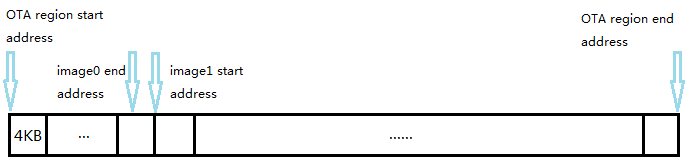

# Duo: WiFi/BLE/USBSerial Setup Protocol in Listening Mode
---

If the Duo is running Particle firmware (by default out-of-box), it has several [device modes](https://docs.particle.io/guide/getting-started/modes/photon/). One of the device modes is [Listening Mode](https://docs.particle.io/guide/getting-started/modes/photon/#listening-mode), in which the Duo will act as SoftAP and BLE peripheral, both broadcasting the name in the format "Duo-xxxx", where "xxxx" varies from different Duos. During in the Listening mode, you can follow the protocol defined here to send command to fetch informations and configure the Duo.

One of the following conditions satisfied will force the Duo enter Listening Mode:

1. By holding the SETUP button for three seconds, until the RGB LED begins blinking blue.

2. If no WiFi credentials stored and the Duo wants to connect to AP. To clear WiFi credentials:

    * Hold the SETUP button for about ten seconds, until the RGB LED blinks **blue** rapidly.
    * Hold the SETUP button and tapping RESET, then continuing to hold SETUP until the on-board RGB turns **white**.
    * Call the [`WiFi.clearCredentials()`](https://docs.particle.io/reference/firmware/photon/#clearcredentials-) in user application.

3. Request by calling the [`WiFi.listen()`](https://docs.particle.io/reference/firmware/photon/#listen-) in user application.

**Note :** When the Duo is in the Listening Mode, if [multithreading](https://docs.particle.io/reference/firmware/photon/#system-thread) is not used, neither the system event loop running backstage nor user application will continue, untill the Listening Mode exits. If multithreading is used, the system event loop running backstage will be blocked untill the Listening Mode exits, while the user application executes normally.

To exit Listening Mode, one of the following conditions must be satisfied:

1. WiFi credentials is configured if using USB serial.

2. "connect-ap" command is received if using WiFi or BLE

3. "finish-update" command is recieved is using WiFi (Duo only)

4. `WiFi.listen(false)` is called in user application only if multithreading is used

## WiFi SoftAP

As described above, when the Duo is in the Listening Mode, it will broadcast as an open SoftAP, wich SSID is "Duo-xxxx" and IP address is 192.168.0.1. At meantime, the Duo starts a TCP server listening on port 5609 and a HTTP server listening on port 80 for receiving commands from client. It will start a TCP server listening on port 50007 for firmware update as well. Then you can connect your mobile phone, laptop or host PC to this SoftAP and start a TCP client or use web brower to communicate with Duo by following the protocol defined here. 

##### TCP/5609 :

Request string :

`command_name\n(parameter_length)\n\n[parameter]`

- The parameter length is essential, while the parameter is optional.
- If parameter is required, it must be of JSON format.
  
Response:

- A JSON string contains the response data.

**Note :** one request / response pair per socket connection.

##### HTTP/80 :

Request :

`http://192.168.0.8/command_name`

- Commands with no data are sent as a GET.
- Commands that require data (e.g. configure-ap) are sent as POST, with the data in the request body

Response :

- Response is sent as the response body and in the JSON format.

##### TCP/50007 :

Request :

- Plain firmware image data block

Response :

- A string that indicates the current firmware updating state machine.

### Fetch Firmware Versions

  - Endpoint: TCP/5609, HTTP/80
  - command_name : `version`
  - parameter_length : `0`
  - parameter : omitted
  - Response string (e.g.) : `{"release string":"0.2.4","bootloader":4,"system part1":7,"system part2":7,"user part":7}`

### Fetch Device ID

  - Endpoint: TCP/5609, HTTP/80
  - command_name : `device-id`
  - parameter_length : `0`
  - parameter : omitted
  - Response string (e.g.) : `{"id":"112233445566778899001122","c":"1"}`

**id** : is the unique ID for the device.

**c** : is the claimed flag. "1" if the device has previously been claimed. "0" if the device has never been claimed before. The device is flagged as claimed after a claim ID has been set (see the `set` command below) and
the device has successfully connected to the cloud.  

### Scan Nearby Access Points

  - Endpoint: TCP/5609, HTTP/80
  - command_name : `scan-ap`
  - parameter_length : `0`
  - parameter : omitted
  - Response string (e.g.) : `{"scans":[{"ssid":"ssid-name","rssi":-30,"sec":value,"ch":value,"mdr":value},{result 1},{...},{result n}]}`

**sec** : describes the security configuration of the scanned AP. It's an enum with one of the following values:

	enum Security {
	    SECURITY_OPEN           = 0;          /**< Unsecured                               */
	    SECURITY_WEP_PSK        = 1;     	  /**< WEP Security with open authentication   */
	    SECURITY_WEP_SHARED     = 0x8001;     /**< WEP Security with shared authentication */
	    SECURITY_WPA_TKIP_PSK   = 0x00200002; /**< WPA Security with TKIP                  */
	    SECURITY_WPA_AES_PSK    = 0x00200004; /**< WPA Security with AES                   */
	    SECURITY_WPA2_AES_PSK   = 0x00400004; /**< WPA2 Security with AES                  */
	    SECURITY_WPA2_TKIP_PSK  = 0x00400002; /**< WPA2 Security with TKIP                 */
	    SECURITY_WPA2_MIXED_PSK = 0x00400006; /**< WPA2 Security with AES & TKIP           */
	}

**mdr** : is maximum data rate for the SSID in kbits/s.

### Configure WiFi Credential

  - Endpoint: TCP/5609, HTTP/80
  - command_name : `configure-ap`
  - parameter_length : length of the parameter string
  - parameter (e.g.) : `{"idx":index,"ssid":"my-ssid","pwd":"hex-encoded pwd","sec":value,"ch":value}`
  - Response string (e.g.) : `{"r":0}` // 0 ok, non zero problem with index/data

**idx** : The value of it in the parameter doesn't matter for now.
  
**ch** : The value of it in the parameter doesn't matter.

**pwd** : 256-bytes ascii hex-encoded string which carries the WiFi password (no greater than 64 characters). If the password is empty, the pwd attribute can be omitted. The plain password is then RSA encrypted with PKCS#1 padding scheme using the device's public key. The encrypted 128-bytes are then ascii hex-encoded, with the most significant nibble (4-bits) first, followed by the lest significant nibble. For example, the encryted 128-bytes `A10322983F...` in Hexadecimal would be encoded as 256 characters `"A10322983F..."`.

**sec** : describes the security configuration of the specified AP. It's an enum with one of the following values:

	enum Security {
	    SECURITY_OPEN           = 0;          /**< Unsecured                               */
	    SECURITY_WEP_PSK        = 1;     	  /**< WEP Security with open authentication   */
	    SECURITY_WEP_SHARED     = 0x8001;     /**< WEP Security with shared authentication */
	    SECURITY_WPA_TKIP_PSK   = 0x00200002; /**< WPA Security with TKIP                  */
	    SECURITY_WPA_AES_PSK    = 0x00200004; /**< WPA Security with AES                   */
	    SECURITY_WPA2_AES_PSK   = 0x00400004; /**< WPA2 Security with AES                  */
	    SECURITY_WPA2_TKIP_PSK  = 0x00400002; /**< WPA2 Security with TKIP                 */
	    SECURITY_WPA2_MIXED_PSK = 0x00400006; /**< WPA2 Security with AES & TKIP           */
	}

### Connect to AP

  - Endpoint: TCP/5609, HTTP/80
  - command_name : `connect-ap`
  - parameter_length : length of the parameter string
  - parameter (e.g.) : `{"idx":0}`
  - Response string (e.g.) : `{"r":0}` // 0 ok, non zero problem with index/data

**idx** : The value of it in the parameter doesn't matter for now.

**Note** : This disconnects the SoftAP after the response code has been sent. Note that the response code doesn't indicate successful connection to the AP, but only that the command was acknoweldged and the AP will be connected to after the result is sent to the client. If the AP connection is unsuccessful, the SoftAP will be reinstated so the user can enter new credentials/try again.

### Fetch Device Public Key

  - Endpoint: TCP/5609, HTTP/80
  - command_name : `public-key`
  - parameter_length : `0`
  - parameter : omitted
  - Response string (e.g.) : `{"b":"ascii hex-encoded data","r":0}` // 0 ok, non zero problem with index/data

The device's public key is in DER format.

### Set Key-Value Paired Data

  - Endpoint: TCP/5609, HTTP/80
  - command_name : `set`
  - parameter_length : length of the parameter string
  - parameter (e.g.) : `{"key":value}`
  - Response string (e.g.) : `{"r":0}` // 0 ok, non zero problem with index/data

The format of the value is determined by the key. Currently these keys are supported:

- `cc`: Sets the claim code. The claim code is 48-bytes, base-64 encoded, as 64 bytes.

### Check Credentials

  - Endpoint: TCP/5609 only
  - command_name : `check-credential`
  - parameter_length : `0`
  - parameter : omitted
  - Response string (e.g.) : `{"has credentials":1}` // 1 for valid credentials stored, 0 for no valid credentials

### Invalid User Application

  - Endpoint: TCP/5609 only
  - command_name : `invalid-user`
  - parameter_length : `0`
  - parameter : omitted
  - Response string : `{"r":1}` // always return 1 for success

This will invalid the user application by setting the user part CRC32 value to 0x00000000. Next time power on or reset, the Duo will enter [Safe Mode](https://docs.particle.io/guide/getting-started/modes/photon/#safe-mode) if the current user application is not overridden by a copy of a valid user application received OTA (Over The Air) from the external flash. This command is usually sent after OTA updating system firmware via local TCP connection. See the [Upload Firmware Images](#upload-firmware-images) section below. It is designed to avoid the imcompatibility between new system firmware and old user application, which might cause the old user application crashed.

### Prepare for Firmware Update

  - Endpoint: TCP/5609 only
  - command_name : `prepare-update`
  - parameter_length : length of the parameter string
  - parameter (e.g.) : `{"file_length":"40960","chunk_address":"0","chunk_size":"128","file_store":"0"}`
  - Response string : `{"r":1}` // always return 1 for success

**file_length** : The total length of the firmware image to to sent.

**chunk_address** : The begining address from which to store the firmware image to be uploaded. If `file_store` is of `1`, then it must be the start address of the FAC region. If `file_store` is of other value, then it is the **offset** address of the OTA region. See the [Memory map](https://github.com/redbear/Duo/blob/master/docs/firmware_architecture_overview.md).

**chunk_size** : It must NOT be of `0`, otherwise, the `file_length` is overridden by setting to the length of the OTA region. The `chunk_size` in this command is not used, as it will be speicfied during firmware data block uploading.

**file_store** : It specifies the region where the firmware image will be stored into. `1` for storing into FAC region, other value for storing into OTA region.

Every time before uploading one firmware image over TCP/50007, this command MUST be sent to initialize the firmware updating state machine. During in the Listening Mode, the Duo is capable of receiving one factory reset image (a default user application) into the FAC region and multiple firmware images (including [system-part1, system-part2 and user application](https://github.com/redbear/Duo/blob/master/docs/firmware_architecture_overview.md)) into the OTA region.

If more than one firmware images to be uploaded to the OTA region, make sure that :

- The `chunk_address` must be 4-KBytes aligned, since the external flash is 4-KBytes organized.
- The `chunk_address` must not locate in the previously uploaded firmware data address range, or it will destroy the previously uploaded firmware image.
- The `chunk_address` + `file_length` must not exceed the OTA region.

**Note** : The current firmware image uploading procedure will abort if sending this command again, while the completed firmware image won't be reversed. 

### Finish Firmware Update

  - Endpoint: TCP/5609 only
  - command_name : `finish-update`
  - parameter_length : `0`
  - parameter : omitted
  - Response string : `{"r":1}` // always return 1 for success

This command will force the Duo exiting from the Listening Mode. If firmware uploading is performed successfully before, a soft-reset will be pending. Thus, once exits from the Listening Mode, the Duo then performs a soft-reset to deploy the uploaded firmware. If none of the firmware uploading is performed successfully, the Duo just exits from the Listening Mode normally without soft-reset.

### Upload Firmware Images

  - Endpoint: TCP/50007 only
  - Request: Plain firmware image data block in sequence
  - Response string :

    - `not init` : indicates the firmware uploading procedure hasn't been initialized yet, i.e. the `prepare-update` command over TCP/5609 hasn't been sent or the command operated failed.
    - `chunk saved` : indicates a firmware data block has been stored in the [OTA region](https://github.com/redbear/Duo/blob/master/docs/firmware_architecture_overview.md#ota-image) or [FAC region](https://github.com/redbear/Duo/blob/master/docs/firmware_architecture_overview.md#factory-reset-image) appropriately.
    - `file saved` : indicates a whole firmware image has been received and stored successfully. Only if the length of the received firmware data is equal to the length specified by `file_length` field in the [Prepare for Firmware Update](#prepare-for-firmware-update) command, then it will echo this string.

Every time before uploading one firmware image over TCP/50007, the [Prepare for Firmware Update](#prepare-for-firmware-update) command MUST be sent over TCP/5609 to initialize the firmware updating state machine. The length of each firmware data block has no limitation. The Duo will calculate the offset from which to store a new received data block internally automatically. But we would suggest that the length of a data block is less than 1024 bytes for trusted transmission. When the `file saved` string is echoed, the Duo will assert a soft-reset flag. Once exiting from the Listening Mode, the Duo will perform a soft-reset to deploy the uploaded firmware images. Of course, a hard reset after a successful firmware uploading will also deploy the uploaded firmware images.

[Reference source code for uploading firmware images over TCP/50007](https://github.com/redbear/DuoSetupCLI/blob/master/src/main.c).

**Note** : A firmware image must be appended with a valid CRC32 so that it can be applied to internal flash. Otherwise, it will be discarded after reboot.

## BLE Peripheral

## USB Serial

## References

* [Duo Introduction](duo_introduction.md)
* [Arduino/C/C++ Programming Reference Manual](programming_reference_manual.md)
* [Firmware Architecture Overview](firmware_architecture_overview.md)
* [How It Works](how_it_works.md)
* [Windows Driver Installation Guide](windows_driver_installation_guide.md)
* [RedBear Discussion Forum](http://discuss.redbear.cc/)

## Resources

* [Modified Particle firmware Source Code](https://github.com/redbear/firmware)

## License

Copyright (c) 2016 Red Bear

Permission is hereby granted, free of charge, to any person obtaining a copy of this software and associated documentation files (the "Software"), to deal in the Software without restriction, including without limitation the rights to use, copy, modify, merge, publish, distribute, sublicense, and/or sell copies of the Software, and to permit persons to whom the Software is furnished to do so, subject to the following conditions:

The above copyright notice and this permission notice shall be included in all copies or substantial portions of the Software.

THE SOFTWARE IS PROVIDED "AS IS", WITHOUT WARRANTY OF ANY KIND, EXPRESS OR IMPLIED, INCLUDING BUT NOT LIMITED TO THE WARRANTIES OF MERCHANTABILITY, FITNESS FOR A PARTICULAR PURPOSE AND NONINFRINGEMENT. IN NO EVENT SHALL THE AUTHORS OR COPYRIGHT HOLDERS BE LIABLE FOR ANY CLAIM, DAMAGES OR OTHER LIABILITY, WHETHER IN AN ACTION OF CONTRACT, TORT OR OTHERWISE, ARISING FROM, OUT OF OR IN CONNECTION WITH THE SOFTWARE OR THE USE OR OTHER DEALINGS IN THE SOFTWARE.
