# Duo: Out-of-Box Experience
---

Glad you've received your Duo from vendor! Thanks for purchasing the Duo and hope you'll have a lots of fun with it! Now let's take it out of the box and have your first experience on the Duo.

* [User Interface](#user-interface)
* [Configure WiFi Credential](#configure-wifi-credential)
    - [Using iOS/Android App](#using-iosandroid-app)
    - [Using Serial Terminal](#using-serial-terminal)
* [Toggle the on-board LED using web browser](#toggle-the-on-board-led-using-web-browser)
* [Further Operations](#further-operations)
    - [Claim your Duo on the Partcile Cloud (Optional)](#claim-your-duo-on-the-partcile-cloud-optional)
    - [Backup the device private key (Highly Recommended)](#backup-the-device-private-key-highly-recommended)
    - [Update system firmware if needed](#update-system-firmware-if-needed)
* [What's Next](#whats-next)
* [References](#references)

## User Interface

* **RESET**: Reset button for resetting the Duo board
* **SETUP**: User button for setting up the Duo
* **RGB**: RGB LED for indicating the Duo status
* **LED**: Single blue LED for user use
* **USB**: Micro USB connector for communication with the Duo

## Configure WiFi Credential

### Using iOS/Android App

Please go to the [App Store]() or [Google Play]() to get and install the Duo App on your iOS/Andriod device.

1. Start the App. It will check the latest firmware on the [GitHub](https://github.com/redbear/Duo/tree/master/firmware/system) first. If there is a new released firmware available on the GitHub, then it automatically fetches the firmware to your iOS/Android device for updating your Duo via local TCP/IP afterwards.

    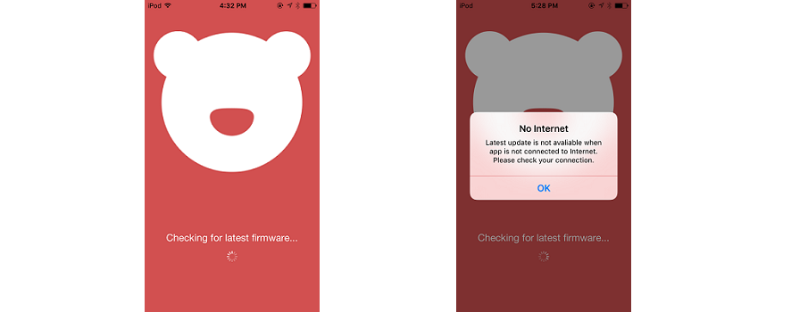

2. After fetching the firmware, it provides two ways for you to configure your Duo: through WiFi or BLE. Now make your Duo enter [Listening Mode](https://docs.particle.io/guide/getting-started/modes/photon/#listening-mode). During in the listening Mode, the Duo acts as WiFi SoftAP and BLE Peripheral. Through both of the ways you can fetch the Duo's device ID which will be used to claim your Duo on Particle Cloud if you want, fetch the firmware versions currently running in the Duo and configure WiFi credential for the Duo. The differences between these two ways are that using WiFi you can update your Duo's system firmware if a newer system firmware available on your iOS/Android device and the password of the credential you are going to configure will be encrypted before sending to your Duo, while using BLE you can NOT update the Duo's firmware and the password of the credential will be sent to your Duo in plain text. If WiFi function or BLE function is tured off or is not available on your iOS/Android device, the sub-section turns to gray to prevent you from moving on.

    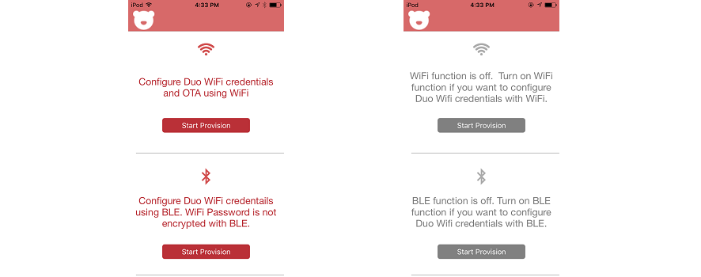

3. Connect your iOS/Android device to Duo through WiFi or BLE:

    - Through WiFi: Follow the instructions on the view bellow or touch on the "**Change WiFi Setting**" button to connect your iOS/Android device to the SoftAP which is broadcasted by your Duo. The SSID of the softAP is in the format "**Duo-xxxx**", where the "xxxx" varies from different Duos. Once your iOS/Android device connected to your Duo, return to the App. 

    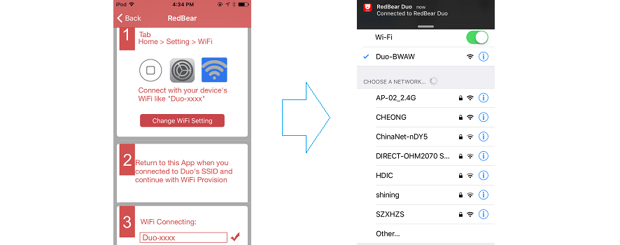

    - Through BLE: The App will list all of the Duos around your iOS/Android device. Simply touch on the Duo which you want to connect to in the scan result list.

    

4. Once your iOS/Android device connected to your Duo, it will automatically scan and list the WiFi networks around your Duo, which for you to choose one of them to configure for your Duo. You can pull down the screen to scan WiFi networks again.

    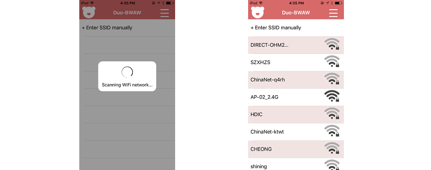

5. Touch on the menu button on the top-right corner, you can fetch your Duo's device ID and its current firmware versions.

    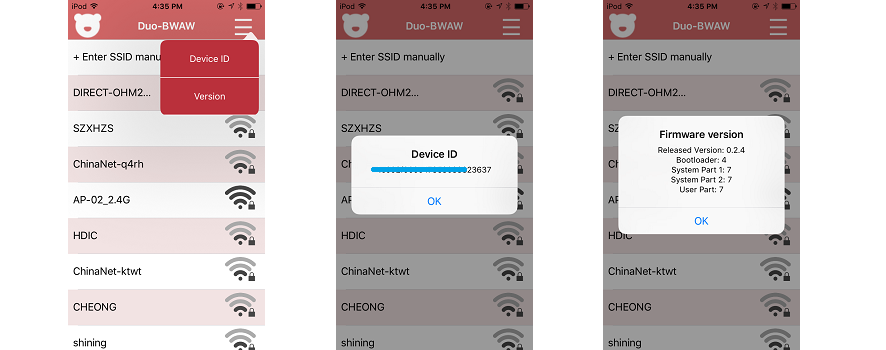

6. Choose one of the WiFi networks in the scan list to configure it for your Duo. If the WiFi network you want to configure is not in the scan list (e.g. hidden WiFi network), you can configure it manually by touching on the first colum "**+ Enter SSID manually**". If the WiFi network you chose is not open, you'll be asked to input password. After configuring WiFi credential for your Duo, the Duo will disconnect the WiFi/BLE connection from your iOS/Android device and try to connect to the WiFi network you've just configured, with the RGB being flashing **green**. If your Duo connects to the AP successfully, it then performs a soft reset to restart. Otherwise, Duo will enter Listening Mode again for you to re-configure Wi-Fi credentials.

    - If you are connecting to your Duo using WiFi, the App just jumps to the view as bellow, since it doesn't know whether your Duo has successfully connected to the WiFi network or not, which due to the currently implemented SoftAp protocol.

    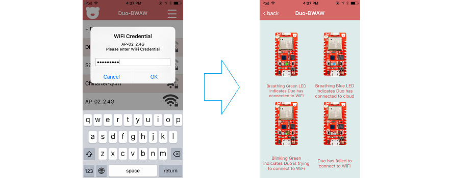

    - If you are connecting to your Duo using BLE, the App waits until your Duo connects to the WiFi network successfully, followed by prints the IP informations. If timeout happens due to wrong password or somehow, the App just returns to step 2.

    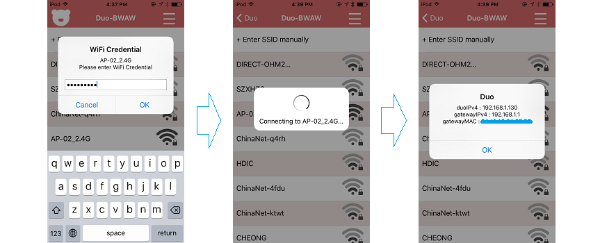

### Using Serial Terminal

1. Power on. Connect your Duo to computer directly via its **Native** USB port with micro USB cable (ensure that the cable has data exchangement capability). Then the on-board RGB LED will keep flashing **blue**, i.e. the Duo is in Listening Mode for you to set Wi-Fi credentials. You'll learn that the Duo is more versatile when it is in Listening Mode.

    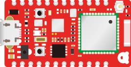

2. Start serial terminal

    * For Windows:

        - Please follow the [Windows Driver Installation Guide](windows_driver_installation_guide.md) to install the driver for Duo.

        - Install the [PuTTY](http://the.earth.li/~sgtatham/putty/latest/x86/putty.zip) serial terminal and start it. Change the Serial port to your one and press the "Open" button. You can also install other serial terminal, e.g. HyperTerminal, Tera Term, Arduino Serial Monitor and etc.
    
            **Note:** If you are using Arduino Serial Monitor, before sending 'i', 'v' and 'w', the line ending should be set to "No line ending", otherwise, the ending character will be treated as the next input character. And before sending SSID, security type, cipher and password, the line ending should be changed to "New line". This is because the Duo will echo message upon received the 'i', 'v' and 'w' commands, but other input prompts should be ended with the '\n' character.

            

    * For OSX and Linux:

        - Start the Terminal and use the "screen" command. On Linux (e.g. Ubuntu), you may need to install screen by:     
        `$ sudo apt-get install screen`.
	
        - On OSX, type:     
        `$ screen /dev/tty.usbmodemXXXXX`, where `XXXXX` is your Duo device serial port.     

            On Linux, type:     
            `$ screen /dev/tty.ACMX`, where `ACMX` is your Duo device serial port. 

            If you are not sure about the serial port, you can list the device by:   
  
            OSX: `$ ls /dev/tty.usbmodem*`    
            Linux: `$ ls /dev/tty.ACM*`
			
            If there is no such device, you may need to check your USB cable.

3. Check system firmware version. Type in '**v**' on the terminal, it will print the version string, e.g.:

        system firmware version: 0.2.4

    In later chapter, you can check the system firmware change-log to decide if you need an update of the system firmware.

4. Fetch unique device ID. Type in '**i**' on the terminal, it will print the unique 12-bytes device ID, e.g.:

        Your device id is 3e00xxxxxxxx343530343432

    In later chapter, the device ID will be used for claiming your Duo on the Particle Cloud, please have a copy of it.

5. Set Wi-Fi Credentials. Type in '**w**' on the terminal, it will ask you to enter the SSID, Security type and password to associate to your AP. Sample input and output:

        SSID: AP-01
        Security 0=unsecured, 1=WEP, 2=WPA, 3=WPA2: 3
        Password: YOUR_PIN_ONLY_YOU_KNOW
        Thanks! Wait while I save those credentials...

        Awesome. Now we'll connect!

        If you see a pulsing cyan light, your device
        has connected to the Cloud and is ready to go!

        If your LED flashes red or you encounter any other problems,
        visit https://www.particle.io/support to debug.

        Particle <3 you!

    If everything is ready, Duo will leave Listening Mode and try to connect to the AP with the RGB flashing **green**. If Duo connects to the AP successfully, it then performs a soft reset to restart. Otherwise, Duo will enter Listening Mode again for you to re-set the Wi-Fi credentials.

    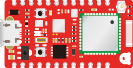

    **Note**: If you are using PuTTY or other serial terminal, when the Duo performs a reset, it disconnect from the terminal and the serial port may not be valid any more. You need to close the serial port, then press the on-board RESET button and open the serial port again to restore the communication with Duo.

## Toggle the on-board LED using web browser

A default web server application now is running on your Duo, with broadcasting a mDNS service. From the serial terminal, you can see the following message:

    Arduino sketch started.

    Note: If your Duo hasn't stored a valid WiFi profile, it will enter the listening mode for provisioning first.

    Waiting for an IP address...

    Duo's web server IP Address: 192.168.1.11 
 
    Make sure your smart device acting as web client is connecting to the same AP as Duo.
    Then open the web browser on your smart device and enter the Duo's web server IP address.
 
    setService
    mdns.begin
    mdns/setup success

* Make sure that the device you are going to start a web browser is connecting to the same AP as your Duo connnects to.

* Open a web browser, e.g. Safari or Chrome. If your browser support mDNS, you can just type "[duo.local](http://duo.local)" as the URL. Otherwisw, type "[http://192.168.1.11](http://192.168.1.11)" as the IP address showed in the serial message.

    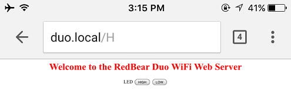

* Press on the "HIGH" or "LOW" button to see any effect on your Duo's blue LED.

## Further Operations

### Claim your Duo on the Partcile Cloud (Optional)

We work closely with Particle team and the Duo for development purpose, can freely and easily access the Particle Cloud and benifit from the services and tools provided by Particle, e.g., Particle Web IDE, Particle Dashboard, Particle Event System and etc. If you want to benefit from these features, you have to work through the following steps to claim your Duo first.

* Make sure that the Duo is connected to the Particle Cloud, i.e. the RGB is breathing **cyan**. If it can not connect to the Cloud, please check out the [Duo Troubleshooting](duo_troubleshooting.md) to fix it first before moving on.

* Go to [Particle Build](https://build.particle.io). Creat an account if you don't have one yet, or just login.

* Navigate to the  tag at the left-bottom corner and click to switch to the devices view.

* Click on the "ADD NEW DEVICE" button.

	
	
* Enter your Duo's device ID that you just got at step 3 and click on the "CLAIM A DEVICE" to claim your Duo. The device ID should be made up of lowercase HEX charaters.

	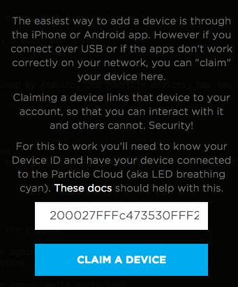

* If claimed successfully, give a name to your Duo and then press the "SAVE" button. Otherwise, please check out the [Duo Troubleshooting](duo_troubleshooting.md)

	
	
* Your Duo will be listed in "Other Devices". Never mind, refresh the whole page, you will see it is now under the "Duo" lable. The breathing cyan dot indicates your Duo is online.

	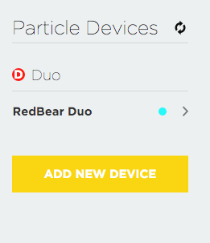

### Backup the device private key (Highly Recommended)

A device private key used for cloud connection establishment and cloud secure data exchangement is generated during manufacture. We highly recommend that you backup the device private key after your Duo connected to the Particle Cloud successfully, in case you destroy it for any reason. To investigate why you'd better backup the device private key, please read the [Devices Provisioning Guide](devices_provisioning_guide.md). 

Before you backup the device private key, since such key is so personal that if you don't trust RedBear during manufacture, you can also follow the [Devices Provisioning Guide](devices_provisioning_guide.md) to provision your Duo by yourself -- It will generate a new device private key in your Duo. And then work through the following steps to backup the device private key:

* Please follow the [dfu-util Installation Guide](dfu-util_installation_guide.md) to install the dfu-util on your computer.

* (**Windows only**) Please follow the [Windows Driver Installation Guide](windows_driver_installation_guide.md) to install the DFU USB driver first.

* Make your Duo enter DFU Mode:

    - Hold down BOTH buttons
    - Release only the RESET button, while holding down the SETUP button.
    - Wait for the LED to start blinking **yellow**
    - Release the SETUP button

* Open the command line prompt,

    - To backup the device private key, type:

            $ dfu-util -d 2b04:d058 -a 1 -s 34 -U device_private_key.der

    - To restore the device private key, type:

            $ dfu-util -d 2b04:d058 -a 1 -s 34 -D device_private_key.der

### Update system firmware if needed

We always recommend you update your Duo to the latest system firmware, since there may have new features added and bugfixes with a new released version. You should have known your Duo's current system firmware version at previous steps. Please check the [system firmware change-log](duo_system_firmware_changelog.md) to see if there is new system firmware version for an update. If available, follow the [Firmware Deployment Guide](duo_firmware_deployment_guide.md) to update the system firmware.

## What's Next

* [Getting Started with Arduino IDE](getting_started_with_arduino_ide.md)
* [Getting Started with Particle Build (Web IDE)](getting_started_with_particle_build.md)

## References

* [Duo Inroduction](duo_introduction.md)
* [Programming Reference Manual](programming_reference_manual.md)
* [Firmware Architecture Overview](firmware_architecture_overview.md)
* [Firmware Deployment Guide](firmware_deployment_guide.md)
* [System Firmware Change-log](system_firmware_changelog.md)
* [Devices Provisioning Guide](devices_provisioning_guide.md)
* [dfu-util Installation Guide](dfu-util_installation_guide.md)
* [Particle Build (Web IDE)](https://build.particle.io)
* [Particle Dashboard](https://dashboard.particle.io/)
* [Particle Docs](https://docs.particle.io/guide/getting-started/intro/photon/)
* [RedBear discussion forum](http://discuss.redbear.cc/)

## License

Copyright (c) 2016 Red Bear

Permission is hereby granted, free of charge, to any person obtaining a copy of this software and associated documentation files (the "Software"), to deal in the Software without restriction, including without limitation the rights to use, copy, modify, merge, publish, distribute, sublicense, and/or sell copies of the Software, and to permit persons to whom the Software is furnished to do so, subject to the following conditions:

The above copyright notice and this permission notice shall be included in all copies or substantial portions of the Software.

THE SOFTWARE IS PROVIDED "AS IS", WITHOUT WARRANTY OF ANY KIND, EXPRESS OR IMPLIED, INCLUDING BUT NOT LIMITED TO THE WARRANTIES OF MERCHANTABILITY, FITNESS FOR A PARTICULAR PURPOSE AND NONINFRINGEMENT. IN NO EVENT SHALL THE AUTHORS OR COPYRIGHT HOLDERS BE LIABLE FOR ANY CLAIM, DAMAGES OR OTHER LIABILITY, WHETHER IN AN ACTION OF CONTRACT, TORT OR OTHERWISE, ARISING FROM, OUT OF OR IN CONNECTION WITH THE SOFTWARE OR THE USE OR OTHER DEALINGS IN THE SOFTWARE.

