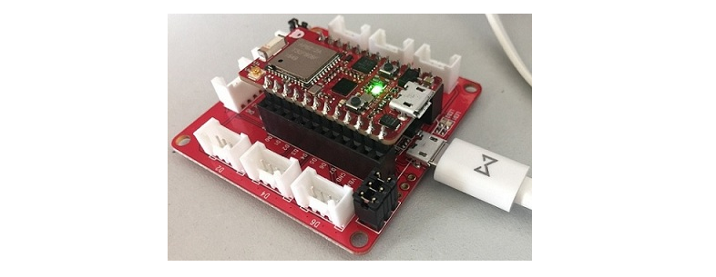

# RBLink Introduction
---

* [Descriptions](#descriptions)
* [Features](#features)
* [Pinouts](#pinouts)
* [Ordering Informations](#ordering-informations)
* [Resources](#resources)

## Descriptions

The RBLink is provided by RedBear, particularly designed for debugging and programming the [RedBear Duo](duo_introduction.md) development board. With the RBLink you can easily attach modules from the [Seeed’s Grove System](https://www.seeedstudio.com/item_list.html?category=45) to your project. No need to pull out your soldering iron -- just attach your sensors and actuators with jumper wires to the RBLink and you’re ready to go.

The RBLink is completely compatible with the ST-Link/v2 adapter provided by STMicroelectronics, so the drivers (for Windows) and softwares for the ST-Link/v2 are also applicable to RBLink, e.g the [ST-LINK Utility](http://www.st.com/content/st_com/en/products/embedded-software/development-tool-software/stsw-link004.html#getsoftware-scroll). 

For Windows users, you have to install the driver for RBLink, please follow the [Windows Driver Installation Guide](windows_driver_installation_guide.md) to install the driver. 

To get started with the ST-LINK Utility, please read the [Software User Manual](http://www.st.com/content/ccc/resource/technical/document/user_manual/e6/10/d8/80/d6/1d/4a/f2/CD00262073.pdf/files/CD00262073.pdf/jcr:content/translations/en.CD00262073.pdf). 

To deploy firmware for the RedBear Duo, please refer to the [Firmware Deployment Guide](firmware_deployment_guide.md).

You can use the RBLink with OpenOCD to debug and program the RedBear Duo. We've provided a [board script](https://github.com/redbear/Duo/blob/master/scripts/openocd/redbearduo.cfg) for quick accessing the Duo.

## Features

* Running the ST-Link/V2 firmware
* USB-based JTAG debugger/programmer
* Two JTAG activity LEDs
* Apple MFi authentication coprocessor support (**MFi license is required)
* USB MSD interface – enabling programming the Duo by drag and drop of firmware file
* USB CDC Virtual Serial Port
* STM32 ST-LINK Utility software compatible
* 8x Seeed Grove System compatible connectors
* 53.5mm x 53.5mm

## Pinouts

**Note: The pinouts of the Grove connectors are mapped to the RedBear Duo board, not to the MCU on RBLink.**

## Ordering Informations

* [RedBear Store](https://store.redbear.cc/product.html)
* [Worldwide Resellers](http://redbearlab.com/buy/)

## Resources

* [ST-LINK Utility](http://www.st.com/content/st_com/en/products/embedded-software/development-tool-software/stsw-link004.html#getsoftware-scroll)
* [RedBear Duo OpenOCD Script](https://github.com/redbear/Duo/blob/master/scripts/openocd/redbearduo.cfg)

## License

Copyright (c) 2016 Red Bear

Permission is hereby granted, free of charge, to any person obtaining a copy of this software and associated documentation files (the "Software"), to deal in the Software without restriction, including without limitation the rights to use, copy, modify, merge, publish, distribute, sublicense, and/or sell copies of the Software, and to permit persons to whom the Software is furnished to do so, subject to the following conditions:

The above copyright notice and this permission notice shall be included in all copies or substantial portions of the Software.

THE SOFTWARE IS PROVIDED "AS IS", WITHOUT WARRANTY OF ANY KIND, EXPRESS OR IMPLIED, INCLUDING BUT NOT LIMITED TO THE WARRANTIES OF MERCHANTABILITY, FITNESS FOR A PARTICULAR PURPOSE AND NONINFRINGEMENT. IN NO EVENT SHALL THE AUTHORS OR COPYRIGHT HOLDERS BE LIABLE FOR ANY CLAIM, DAMAGES OR OTHER LIABILITY, WHETHER IN AN ACTION OF CONTRACT, TORT OR OTHERWISE, ARISING FROM, OUT OF OR IN CONNECTION WITH THE SOFTWARE OR THE USE OR OTHER DEALINGS IN THE SOFTWARE.

