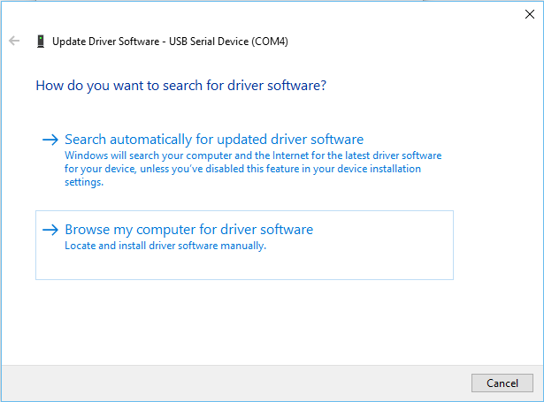
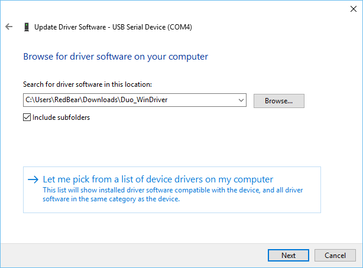
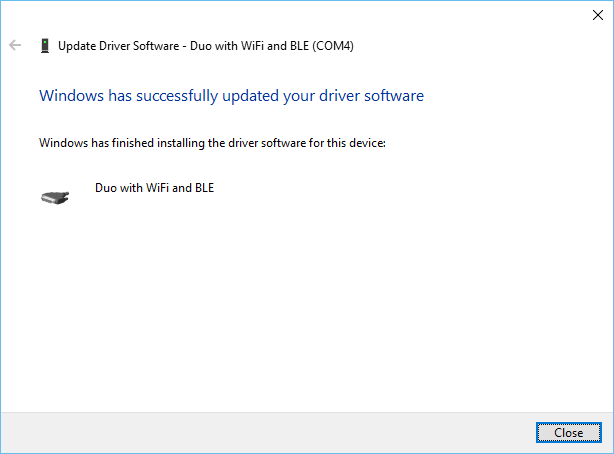
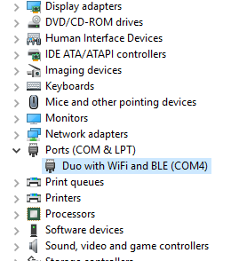
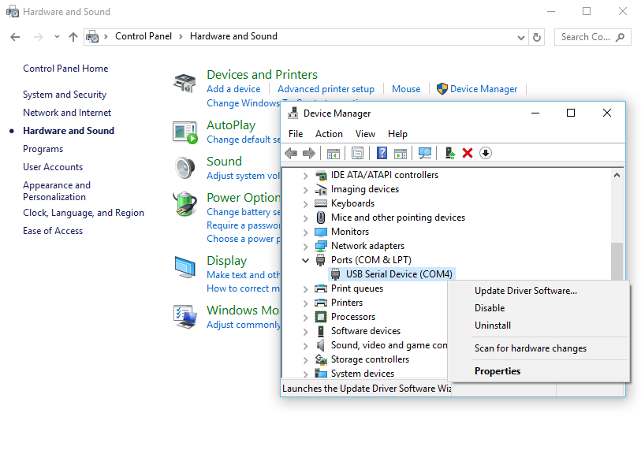
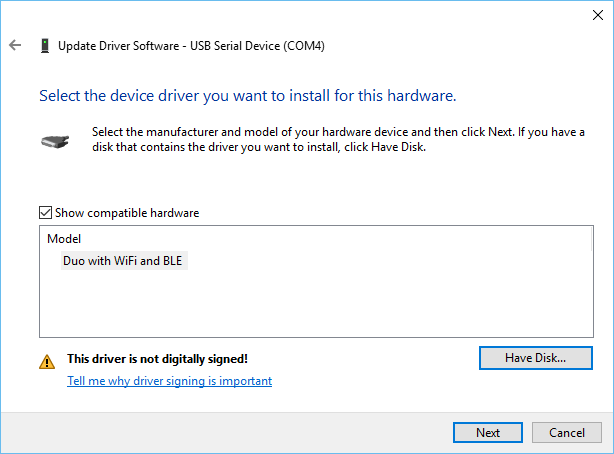

# Duo: Windows Driver Installation Guide
---

**Note: All the drivers mentioned here are for the Duo that running the Particle firmware. For the Duo that running the WICED application hasn't  implemented the USB device capability.**

This guide aims to show you how to install the driver for Duo, including application USB driver and DFU USB driver, and the driver for RBLink if you have one in hand. 

This guide is for Windows user only. Mac and Linux users need not to install driver for Duo.

* [Install Duo Application USB Driver](#install-duo-application-usb-driver)
* [Install Duo DFU USB Driver](#install-duo-dfu-usb-driver)
* [Install RBLink USB Driver](#install-rblink-usb-driver)

## Install Duo Application USB Driver

After your Duo boots-up to run system firmware, it will appear as USB comport device on your computer. The device name is **"Duo with WiFi and BLE"**.

### Windows XP / 7

* [Download](https://github.com/redbear/Duo/raw/master/driver/windows/duo_win_driver.zip) the Windows driver and unzip the file. It is fine to unzip this as a default into your 'Downloads' folder.

* Navigate to "Control Panel > Hardware and Sound > Device Manager" and double-click on your Duo device under "Other Devices".
	
* Right click the device and click "Update Driver", and select "Browse for driver software".

	

* On the next screen click "Let me pick from a list of device drivers on my computer".

	

* Click the "Have Disk..." button to open the directory to find `duo.cat`. Navigate to the folder you download the driver, or wherever you unzipped the drivers, by clicking the "Browse..." button. Click "Next" to install the driver.

* Driver installed.

	

* You will see 'Duo with WiFi and BLE' under Ports.

	

### Windows 8 / 10

For Windows 10, it seems that you may skip this, since it already has a built in driver for serial port -- it shows as USB Serial Device.

In the "Device Manager", your Duo device may be listed under "Ports":

But you can still install the driver for Duo by following the steps as installing driver for Windows XP / 7.

If you cannot install the driver, it is due to the driver is not digitally signed, applied to Windows 8 / 10. 

Please follow this [guide](http://www.howtogeek.com/167723/how-to-disable-driver-signature-verification-on-64-bit-windows-8.1-so-that-you-can-install-unsigned-drivers/) to disable the driver signature verification temporarily first and try again. Once you do that, redo the driver installation steps. We are working on getting the driver signed so you won't have to do this anymore.

If the follow screen prompt out, select "Install this driver software anyway".

## Install Duo DFU USB Driver

Connect your Duo to computer and put it in the DFU Mode:

1. Hold down BOTH buttons
2. Release only the RESET button, while holding down the SETUP button.
3. Wait for the LED to start blinking **yellow**
4. Release the SETUP button

The Duo will appear as "Other Devices" on your computer. The device name is **"Duo DFU Mode"**.

* Download [Zadig](http://zadig.akeo.ie/) utils.

* Connect your Duo to computer and make it enter DFU mode.

* Run Zadig. Click on "Options > List all devices" and Select "Duo DFU Mode" and 'libusbK' for the driver, press the "Install Driver" button.

    

* It will show "Driver installed successfully".


## Install RBLink USB Driver

For the RBLink, since it is compatible with STLink, download the driver from ST website and follow the instructions provided.

[STLink Driver](http://www.st.com/web/en/catalog/tools/PF260219)

## What's Next

* [Getting started with Arduino IDE for Duo](duo_getting_started_with_arduino.md)
* [Getting started with Particle Build (WebIDE)]()

## Reference

* [Duo inroduction](duo_introduction.md)
* [Disable driver signature on Windows 8 / 10](http://www.howtogeek.com/167723/how-to-disable-driver-signature-verification-on-64-bit-windows-8.1-so-that-you-can-install-unsigned-drivers/) 
* [Zadig Wiki page](https://github.com/pbatard/libwdi/wiki/Zadig)
* [ST-Link Utility and driver](http://www.st.com/web/en/catalog/tools/PF260219)
* [dfu-util installation guide](dfu-util_installation_guide.md)

## License

Copyright (c) 2016 Red Bear

Permission is hereby granted, free of charge, to any person obtaining a copy of this software and associated documentation files (the "Software"), to deal in the Software without restriction, including without limitation the rights to use, copy, modify, merge, publish, distribute, sublicense, and/or sell copies of the Software, and to permit persons to whom the Software is furnished to do so, subject to the following conditions:

The above copyright notice and this permission notice shall be included in all copies or substantial portions of the Software.

THE SOFTWARE IS PROVIDED "AS IS", WITHOUT WARRANTY OF ANY KIND, EXPRESS OR IMPLIED, INCLUDING BUT NOT LIMITED TO THE WARRANTIES OF MERCHANTABILITY, FITNESS FOR A PARTICULAR PURPOSE AND NONINFRINGEMENT. IN NO EVENT SHALL THE AUTHORS OR COPYRIGHT HOLDERS BE LIABLE FOR ANY CLAIM, DAMAGES OR OTHER LIABILITY, WHETHER IN AN ACTION OF CONTRACT, TORT OR OTHERWISE, ARISING FROM, OUT OF OR IN CONNECTION WITH THE SOFTWARE OR THE USE OR OTHER DEALINGS IN THE SOFTWARE.

